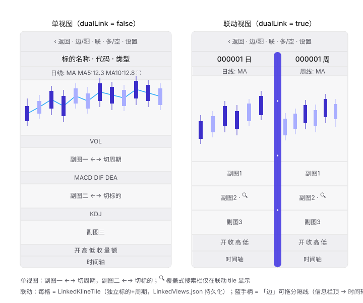

# K线页面布局设计说明

> 本文档描述 K 线详情页（`KlineDetailView`）的完整布局结构与实现原理，
> 供后续改版/排查时快速定位。整理日期：2026-08-31。

## 目录

- [布局总览图](#布局总览图)
- [1. 页面骨架](#1-页面骨架)
- [2. 顶部两行：工具栏与信息栏](#2-顶部两行工具栏与信息栏)
- [3. chartArea 的三态](#3-chartarea-的三态)
- [4. 单个图表内部（KlineChartView）](#4-单个图表内部klinechartview)
- [5. 联动体系](#5-联动体系)
- [6. 分隔线的三层设计](#6-分隔线的三层设计)
- [7. 数据流](#7-数据流)
- [8. 涉及的关键文件](#8-涉及的关键文件)

---

## 布局总览图



---

## 1. 页面骨架

代码位置：`Kline/KlineDetailView.swift` 的 `body`（约 L179-L237）。

`body` = `GeometryReader` + `ZStack(topLeading)`，三层叠放：

1. **主 VStack（spacing: 0）**，自上而下：
   - `2pt` 顶部留白（压缩状态栏空白）
   - `toolbarRow`（第一行工具栏）
   - `0.5pt` 分隔线
   - `infoBarRow`（第二行信息栏）
   - `chartArea`（`frame(maxHeight: .infinity)` 吃掉剩余全部高度）
2. **可拖分隔线覆盖层** `linkedDividerOverlay`：仅 `dualLink && edgeAdjust` 时出现，
   `offset(y: infoBarTopOffset)` 精确从**信息栏顶部**开始
   （偏移 = 工具栏实测高度 + 2 + 0.5，工具栏高度用 `TopBarHeightPreferenceKey` 实测，兜底 34）
3. **设置面板 overlay**（`showSettings` 时，底部 75% 高度面板）

公式/系统指标编辑器打开时（`showCustomEditor` / `showSystemEditor`），顶部两行整体隐藏实现真全屏。

## 2. 顶部两行：工具栏与信息栏

### 工具栏（toolbarRow，约 L261-L360）

自左向右：

| 按钮 | 行为 |
|---|---|
| `‹ 返回` | 关闭详情页 |
| `边` / `📌` | 互斥显示：联动且无光标 → 显示「边」（边线调节）；否则显示 📌（固定光标） |
| `联` | 切换单视图/双联动（退出联动时重置 edgeAdjust、pinEnabled） |
| `多`/`空` | 全局镜像开关（主图与所有副图数值取负） |
| `⚙ 设置` | 弹出底部设置面板 |

### 信息栏（infoBarRow，约 L363-L399）

- **单视图**：`名称 · 代码 · 类型` 一行。
- **联动**：`infoLinkedRow` 按 `config.dualDividers(for: count)` 把整行分成与视图数相同的格子，
  每格居中显示该视图的 `代码+周期`，**格间竖线的 x 坐标与主图分隔线完全一致**（同一个 bounds 数组）。

## 3. chartArea 的三态

```
isLoading == true   → 转圈加载页
dualLink == true    → dualLinkArea()（联动多视图）
currentSeries == nil → 空数据页
否则                 → 单图 chartView(series:)
```

## 4. 单个图表内部（KlineChartView）

代码位置：`Kline/KlineChartView.swift` 的 `body`（约 L1589-L1650）。

### 高度公式

```
legend = 18pt × 4   （主图指标栏 + 3 个副图指标栏）
time   = 18pt × 2   （行情行 + 时间轴）
chartHeight = 总高度 - 4×18 - 2×18 = 总高度 - 108
副图各占 chartHeight × 0.15，主图占剩余部分
```

`mainFullscreen`（放大模式）下副图全部隐藏、主图占满除顶部指标栏与底部两行之外的全部空间。

### VStack 顺序

```
主图指标栏 → 主图 → (副图指标栏 + 副图) × 3 → 行情行 → 时间轴
```

### ZStack 上叠加的层

- 分片双指手势层（主图/各副图各一块）
- 双十字光标 overlay（可动光标 + 固定光标）
- 公式编辑器（自定义/系统指标）
- 指标选择 bottomSheet

## 5. 联动体系

### 持久化（LinkedViewStore）

- 以**主标的 metaID 为 key**，存到沙盒 `Documents/LinkedViews.json`，值是 `[LinkedViewConfig]`
  （每视图独立 `index` / 标的 / 周期）。
- 无记录时默认 2 视图（左日线、右周线）。
- `setViewCount` 负责增删补裁（支持 2/3/4 视图），`reset` 恢复默认。

### 排布（dualLinkArea，约 L468-L499）

```
bounds = [0, 分隔线..., 1]
每个 tile frame(width: right - left)
tile 间画 1px 静态竖线（allowsHitTesting(false)）
```

### tile（LinkedKlineTile）

- 自己 `fetchBars(metaId, period)` 加载数据，`loadTicket` 递增序号丢弃过期异步结果。
- `metaId: nil` **禁用共享 ChartCacheStore**：避免多个 tile 用相同 metaId 并行预计算互相污染缓存
  （这是之前「联动切周期后副图空白」问题的根因）。
- `.id(chartIdentity)` 绑定 `(metaID, period)`，周期/标的切换必定重建全新图表状态。

### 滑动角色（联动态）

| 位置 | 手势 | 效果 |
|---|---|---|
| 副图一（上） | ←→ | **切周期**（写回本视图配置并持久化） |
| 副图二（下） | ←→ | **切标的**（沿行情页候选列表） |

🔍 按钮只在联动 tile 的副图二指标栏显示，点击展开覆盖式搜索栏（复用 `SearchContentView`
行情搜索逻辑）+ 弹出系统键盘。

## 6. 分隔线的三层设计

这是布局中最容易混淆的部分，共三层：

| 层 | 出现条件 | 作用 |
|---|---|---|
| ① 静态细线 | 始终（联动时） | `dualLinkArea` 内 1px 竖线 + 信息栏格子竖线（同一 x，纯显示不可交互） |
| ② 「边」覆盖层 | `dualLink && edgeAdjust` | `linkedDividerOverlay`，**纵贯信息栏顶 → 时间轴底**（不含工具栏），每条分隔线一个 `DualSplitDivider` |
| ③ DualSplitDivider | 同上 | 独立 `@State dragRatio`，拖动中只重画分隔线自身（实时跟随、不重渲染图表、不干扰图表手势），**松手才** `onCommit → updateDivider → config.dualSplitPositions` 持久化占比；相邻分隔线互相约束 min/max 防越界 |

「边」开启同时置 `suppressCrosshair` → 所有图表禁止十字光标并清除残留光标。

## 7. 数据流

- **单视图**：`loadData()` 一次性后台加载全部 5 个周期的 series；当前周期由可见图自行分块预计算，
  算完后 `prefetchOtherPeriods` 后台补齐其它周期写入缓存。
- **联动 tile**：每个 tile 只加载自己 `(metaID, period)` 的数据，前台完整重算（不走共享缓存）。

## 8. 涉及的关键文件

| 文件 | 职责 |
|---|---|
| `Kline/KlineDetailView.swift` | 页面骨架、顶部两行、chartArea 三态、联动排布、可拖分隔线覆盖层、设置面板 |
| `Kline/LinkedKlineTile.swift` | 联动单视图块：数据加载 + 图表渲染 + 副图二覆盖式搜索 |
| `Kline/LinkedViewStore.swift` | 联动视图配置持久化（按主标的 metaID → LinkedViews.json） |
| `Kline/KlineChartView.swift` | 单个图表：主图/副图/时间轴布局、手势、光标、指标计算与预计算 |
| `Kline/ChartConfigStore.swift` | 分隔线占比（dualSplitPositions）等图表配置持久化 |
