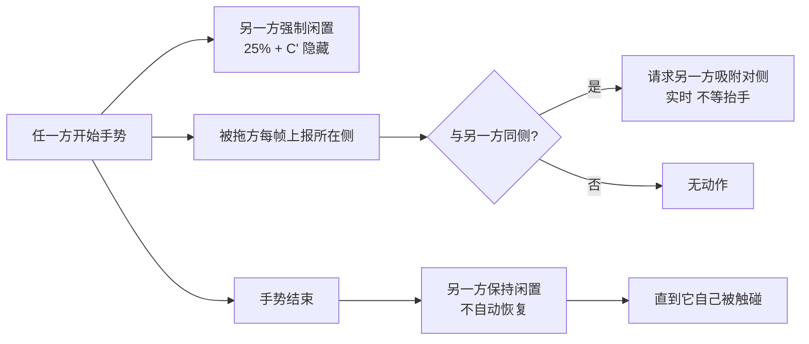

# 两按钮耦合（同侧互斥 + 手势期间强制闲置）

两个悬浮按钮之间的两条耦合规则，由共享协调对象居中协调。

## 1. 它是什么 / 在哪

| 项 | 位置 |
| --- | --- |
| 协调对象（唯一状态持有者） | `Kline/App/FloatingAccessoryCoordinator.swift` |
| 旧按钮接入点 | `Kline/App/FloatingAccessory.swift`：`onChanged` / `onEnded` / `$activeOwner` / `$snapRequest` |
| 新按钮接入点 | `Kline/App/FloatingAccessoryWheel.swift`：同上 |
| 落位计算与侧判定 | `Kline/App/FloatingAccessoryShared.swift`：`FloatingAccessoryPlacement` |

下图讲「拖动一个按钮时，两边各发生什么」，从「对方开始手势」读起。

图里没画出的部分：

- 两条规则**互相独立**：即使不拖动（只是在环上转圈），另一方的强制闲置也生效；
- 「每帧上报」只在**整钮拖动**分支里发生，转圈分支不动按钮、因此不触发互斥；
- `H → I` 的解锁不需要任何状态位，是对方自己 `onChanged` 里 `cancelIdleFade()` 的**自然结果**。

**调用关系**：任一按钮 → `FloatingAccessoryCoordinator`（`beginGesture` / `reportDrag` / `requestSnap`）
→ 另一按钮（`$activeOwner` 与 `$snapRequest` 两个订阅入口）。

## 2. 关键决策（为什么这么写）

- [[20260919-两按钮同侧互斥实时反向吸附]] — 判定放 `onChanged`（不等抬手）；用「乐观上报」实现幂等
- [[20260919-手势期间另一方强制闲置]] — 单向耦合，必须作废对方在途计时，且不自动恢复

## 3. 已知陷阱

- [[20260919-Published同值赋值也会发布]] — 本模块最危险的坑：`onChanged` 每帧调用 + `@Published` 每次赋值都发布

## 4. 亮点 / 可复用的做法

- **「乐观上报」实现幂等**：请求方在发出请求的同一刻就把对方的已知状态改写成目标值，
  于是「同一状态每帧最多发一次请求」不需要任何额外的 in-flight 标记。任何「高频触发同一个异步动作」的场景都可照搬。
- **高频状态与发布状态分离**：`knownSides` 是普通属性（不发布），只有真正需要驱动界面的
  `activeOwner` / `snapRequest` 才是 `@Published`，且都带「值未变不写」守卫。

## 5. 遗留 / 未验证

- [ ] **真机未验证**：越过中线是否**未等抬手**就反向吸附、快速往返是否反向吸附两次、手势期间对方是否立即变 25%。
      **怎么验**：见 `.trae/specs/add-second-floating-accessory/checklist.md` 的「两按钮耦合」节。**谁来验**：用户真机。
- [ ] **双手同时操作两个按钮**未定义行为：两边会互相请求吸附，可能「拧住」。按规格「允许并行」未做串行化。
      真机确认手感后决定是否加锁。
- [ ] **应用启动瞬间**的不变量由「新按钮启动矫正」保证；若历史数据异常（两按钮都存到同侧），
      矫正只动新按钮、不动旧按钮 —— 这是有意的（旧按钮落位不该被新功能覆盖）。