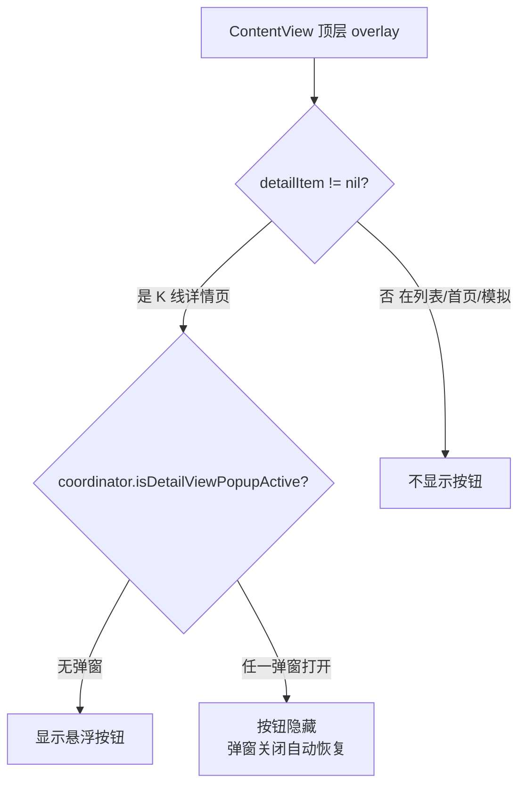
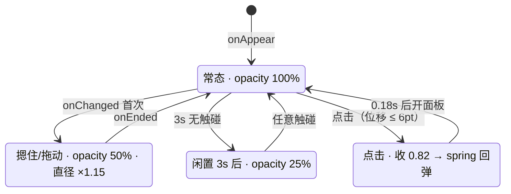

# 悬浮按钮（辅助触控）

自选 / 行情页常驻的**旧按钮**：四层同心圆，可拖动吸附到左右边缘、点击弹出底部面板。

> **现在共有两个悬浮按钮**：本篇只讲旧按钮。新按钮（三圆 A'/B'/C'、环上转圈驱动光标）见
> [[新按钮（转圈驱动光标）]]，两者之间的耦合规则见 [[两按钮耦合]]。
> 命名约定：圆用 A/B/C/D 与 A'/B'/C'、环用 Z/X/Q/W 与 Z'；指代整个控件时说「旧按钮」「新按钮」。

## 1. 它是什么 / 在哪

| 项 | 位置 |
| --- | --- |
| 视图（按钮 + 面板 + 落位持久化） | `Kline/App/FloatingAccessory.swift` |
| `FloatingAccessoryButton` | 同文件 :42 |
| `FloatingAccessoryPanel` | 同文件 :234 |
| `FloatingAccessoryStore` | 同文件 :14 |
| 装配点（根视图顶层 overlay） | `Kline/App/ContentView.swift:87-107` |
| 面板圆角 Shape（**跨模块复用**） | `Kline/Chart/KlineChartView.swift:1344` `TopRoundedCornerRect` |
| UITest 标识 | `accessory.button` / `accessory.close` |

**显示范围判定**（2026-09-23 改）。下图从 ContentView 的 overlay 入口往下看，说明为何两个判定一起就能覆盖「K 线详情页打开 + 无任何弹窗」：

图里没画出的部分：
- 按钮只在 `detailItem != nil`（根视图全屏 K 线详情页 overlay 打开）时才挂载 —— 自选/行情/首页/模拟**列表页**不再显示按钮。
- 弹窗状态由 **KlineDetailView 聚合自身全部弹窗 state** 后推送到 coordinator（避免让 ContentView 观察一堆细节），ContentView 只看一个 `isDetailViewPopupActive` Bool。
- 弹窗自动隐藏是 `opacity` + `allowsHitTesting` 为 0，按钮本体不卸载 —— 与 `isAccessoryPanelPresented` 的处理同构。
- 弹窗关闭后按钮靠 SwiftUI 的 `@ObservedObject` 订阅 coordinator 自动恢复，无需手动管理时序。
- 详情页是根视图 overlay，所以从自选/行情进的详情页、首页搜索进的详情页**都自动命中** detailItem 判断；无论 selectedTab 是什么。

详见 [[20260923-悬浮按钮显示范围改为detailItem判定+弹窗自动隐藏]]（2026-09-19 的旧决策已被取代）。

**调用关系**：`ContentView` → `FloatingAccessoryButton(action:)`；点击 → `isAccessoryPanelPresented = true` → 按钮 `opacity 0` + `allowsHitTesting(false)`，同时 `FloatingAccessoryPanel` 出现。按钮是**隐藏而非卸载**，关闭后原位恢复、不丢落位。

### 触摸状态机

下图是按钮的全部状态与迁移，从 `[ * ]` 起读；每个状态描述行里是该态的外观取值：

图里没画出的部分：

- `摁住态`(s1) 与 `果冻`(s3) 的缩放是**叠乘**关系（`(isPressing ? 1.15 : 1) * jellyScale`），为清晰起见在图里分开画；
- `淡出态`(s2) 是可被任意触碰打断的**稳定态**，不是过渡动画；
- `s1 → s0` 的 `onEnded` 之后还会无条件调一次 `scheduleIdleFade()`（含点击分支），实现「任何触碰后保持 100% 三秒」；
- **图里少了一个外部置入态**：旧按钮被**新按钮**的手势强制进入闲置（同 `s2` 外观），
  且不会因对方手势结束而自动恢复 —— 见 [[20260919-手势期间另一方强制闲置]] 与 [[两按钮耦合]]。

## 2. 关键决策（为什么这么写）

- [[20260923-悬浮按钮显示范围改为detailItem判定+弹窗自动隐藏]] — 2026-09-23 改：只在 detailItem != nil 时显示 + K 线详情页任一弹窗打开时自动隐藏（取代 2026-09-19 的 selectedTab 判定）
- [[20260919-悬浮按钮-四层同心圆几何]] — A=2D 与 Z=X+Q 两式只能定出 B，C 取 X=Q 补齐
- [[20260919-悬浮按钮-填充淡化用向白混合]] — 填充保持不透明，整体变淡只在外层 `.opacity()` 一处
- [[20260919-悬浮按钮-dragDelta用State而非GestureState]] — 需与吸附目标同事务归零，自动归零会跳一下
- [[20260919-悬浮按钮-果冻先跑完再开面板]] — 面板一开按钮即隐藏，同步触发则反馈不可见

新按钮与两按钮耦合的相关决策分别索引在 [[新按钮（转圈驱动光标）]] §2 与 [[两按钮耦合]] §2；
「联动多图模式下光标自动移动期间两个按钮一起隐藏」见 [[20260919-光标自动移动时隐藏两个悬浮按钮]]。

## 3. 已知陷阱

- [[20260919-重叠子视图的透明度被逐层叠加]] — `.opacity()` 对重叠子视图逐层施加，α<1 时内圈反比外圈深；须先 `compositingGroup()`
- [[20260919-内描边不能用本圈填充色]] — `strokeBorder` 是内描边，同色即被自身填充吞掉
- [[20260919-固定高度贴底面板ignoresSafeArea无效]] — 面板默认居中放置，须用贪婪 frame 钉底
- [[20260919-Published同值赋值也会发布]] — 高频 `onChanged` 里给 `@Published` 赋值会造成发布风暴

## 4. 亮点 / 可复用的做法

- **闲置淡出用「令牌自增」而非持有 `DispatchWorkItem`**（`:92`、`:117-130`）：触碰只需 `idleFadeToken += 1` 即让在途计时作废，不用管理取消与生命周期；`onDisappear`（`:197`）复用同一手法防泄漏。任何「延时任务需要被频繁打断」的场景都可照搬。
- **可调参数集中成常量数组**：几何（`radiusRatios`）、配色（`bandColors`）、描边浓度（`ringStrokeOpacities`）各为一个数组。本轮需求连续调整了四轮外观，每轮都只改一行。
- **隐藏而非卸载按钮**：面板呈现期间 `opacity 0` + `allowsHitTesting(false)`，关闭后落位与状态无需重新求值。

## 5. 遗留 / 未验证

- [ ] **面板内容为空** —— `FloatingAccessoryPanel` 只有标题 + 关闭，`heightFraction` 暂取 0.5。
      **怎么验**：填充内容后重新定高，确认贴底无灰缝（见 [[20260919-固定高度贴底面板ignoresSafeArea无效]]）。
- [ ] **整批改动真机未验证**（同心圆外观、触摸状态机、`compositingGroup`、去阴影）。
      **怎么验**：先跑 UITest 确认 `accessory.button` 可点，再手动过一遍四态顺序 —— 静止 3s 应淡至 25% → 摁住应变大 15% 且到 50% → 抬手后 3s 内保持 100% → 点击有果冻且随后弹面板；浅色 / 深色主题各走一遍，**重点看 50% / 25% 两态下 Z 是否仍比 X 深**。
      **谁来验**：用户真机（CI 只能保证编译，外观与手感无法在云端判定）。
- [ ] **深色模式下 W 圈描边几乎不可见** —— `opacity` 0.125 × 整体 0.25 ≈ 3%，属预期。
      **怎么验**：并入上一条同一次真机走查目视确认；嫌淡就抬 `ringStrokeOpacities` 后两位。
- [ ] **与 K 线详情页图表手势是否互相干扰** —— 按钮浮在详情页之上，需确认不抢手势。
      **怎么验**：从行情页进详情页，分别在按钮附近、多图联动区域做单指拖动与双指缩放，确认图表手势与按钮拖动都不串。**谁来验**：用户真机。
- [ ] **旧按钮新增的协作行为真机未验证**（同侧互斥、被新按钮手势强制闲置）。
      **怎么验**：拖动旧按钮越过屏幕中线 → 新按钮应未等抬手就吸附到对侧；操作新按钮期间 → 旧按钮应立即变 25% 且之后不自动恢复。
      **谁来验**：用户真机。**旧按钮的外观 / 四态 / 点击弹面板 / 单钮吸附 / 落位持久化本次未改动**（只在既有分支追加协作调用）。