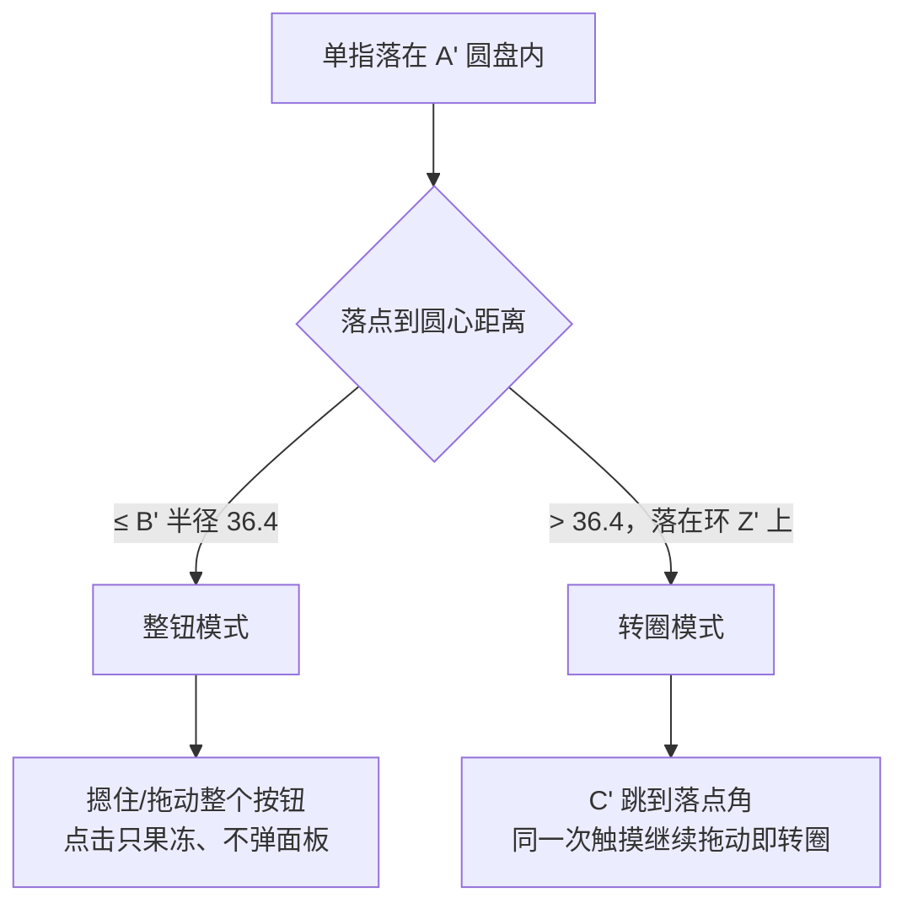
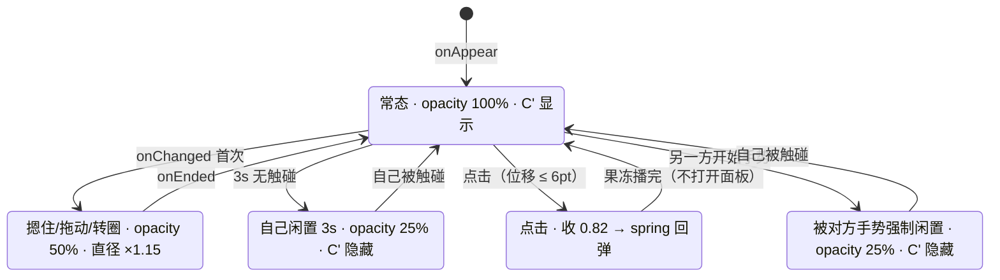

# 新按钮（转圈驱动光标）

自选 / 行情页的第二个悬浮按钮：三圆结构 A'/B'/C'，在环 Z' 上转圈即可驱动 K 线光标（**一圈 360° = 20 根**）。

## 1. 它是什么 / 在哪

| 项 | 位置 |
| --- | --- |
| 视图（三圆 + 触摸状态机 + 转圈） | `Kline/App/FloatingAccessoryWheel.swift` |
| 共享几何 / 落位 / 持久化 | `Kline/App/FloatingAccessoryShared.swift` |
| 与旧按钮、图表的协调对象 | `Kline/App/FloatingAccessoryCoordinator.swift` |
| 装配点（与旧按钮同一 `selectedTab` 判定） | `Kline/App/ContentView.swift:87-107` |
| 图表侧消费入口 | `Kline/Chart/KlineChartView.swift`：`isMainTile` / `applyAccessoryCursorAdvance` / `finishAccessoryRotation` |
| 落位持久化 key | `kline.accessory2.centerX` / `centerY`（旧按钮仍是 `kline.accessory.*`，**不能改**） |
| UITest 标识 | `accessory2.button` |

**命名**：圆 A'/B'/C'、环 Z'；指代整个控件时一律说「新按钮」，不与旧按钮的 A/B/C/D、Z/X/Q/W 混用。

### 交互分区

下图讲「一次触摸落在哪里决定进入哪条手势路径」，从落点半径读起。

图里没画出的部分：

- **A' 的描边没有独立行为**，命中区就是 A' 围出的整个圆盘（= B' 盘 ∪ 环 Z' 环带）；
- 模式在本手势**第一次回调**时定下、之后整个手势沿用 —— 所以转圈中手指可以穿过圆心附近再拖出去，
  模式不会翻转（圆心 8pt 内冻结角度，见 §2 决策链接）；
- 转圈期间与整钮模式一样算「被摁住」（+15% 直径、50% 透明度）。

### 触摸状态机

从 `[ * ]` 起读；每个状态描述行里是该态的外观取值。

图里没画出的部分：

- `s3` 果冻与 `s1` 的放大是**叠乘**关系（`(isPressing ? 1.15 : 1) * jellyScale`），为清晰分开画；
- `s2` 与 `s4` 外观相同但**来源不同**：`s2` 是自己 3 秒没被碰，`s4` 是被另一方强制；
- `s4` **不会**因为另一方手势结束而自动退出（单向耦合，见 [[20260919-手势期间另一方强制闲置]]）。

**调用关系**：`ContentView` → `FloatingAccessoryWheel()`；转圈 → `FloatingAccessoryCoordinator.advanceCursor(by:)`
→ 主格 `KlineChartView` 的 `.onReceive` → `applyAccessoryCursorAdvance`。

## 2. 关键决策（为什么这么写）

- [[20260919-新按钮几何由旧按钮派生]] — B'=旧A×1.3、环 Z'=旧D、A'=B'+2×Z'，轨迹半径恰为环中径
- [[20260919-转圈驱动光标必须新建命令通道]] — `selectedIndex` 是 `@State`，必须新建通道；命令带 `seq`
- [[20260919-贴边推进用按转圈步进而非按时间动画器]] — 否则「一圈 = 20 根」会被转速破坏

## 3. 已知陷阱

- [[20260919-Published同值赋值也会发布]] — 高频 `onChanged` 里给 `@Published` 赋值会造成发布风暴
- [[20260919-内描边不能用本圈填充色]] — 环 Z' 必须保持透明：若照搬旧按钮最外环 Z 的纯黑填充，
  浅色模式下与同为 `label` 色的 C' 同色，C' 会完全不可见

## 4. 亮点 / 可复用的做法

- **显示角与里程表解耦**：`displayAngleOffset` 只影响 C' 画在哪，`odometer` 只由增量累加。
  于是「落点接管时 C' 瞬移」与「K 线推进量连续」可以同时成立 —— 任何「位置可跳变但增量必须连续」的场景都可照搬。
- **8pt 奇点冻结**：`atan2` 在圆心附近抖动剧烈，冻结时不更新 `lastRawAngle`，
  这样手指从圆心附近回到环上后增量仍从冻结前的角度**连续续算**（若同时更新 `lastRawAngle` 就会丢一段）。

## 5. 遗留 / 未验证

- [ ] **真机未验证**（外观、手感、转圈驱动光标全链路）。
      **怎么验**：见 `.trae/specs/add-second-floating-accessory/checklist.md` 的「几何与外观 / 触摸状态机 / 转圈 → 光标」三节。
      **谁来验**：用户真机（外观与手感无法在云端判定）。
- [ ] **多处有意偏离已批准 spec**（已向用户说明）：①贴边推进改为按转圈步进；②接管只改显示偏移不动里程表。
      两处都记在 [[20260919-贴边推进用按转圈步进而非按时间动画器]]。
- [ ] **极快转动时的性能未验证**：转一圈会触发 20 次 `endOffset` 变化，收尾只做一次指标重算；
      若快速连转多圈出现卡顿，需考虑对窗口平移做节流。