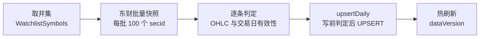
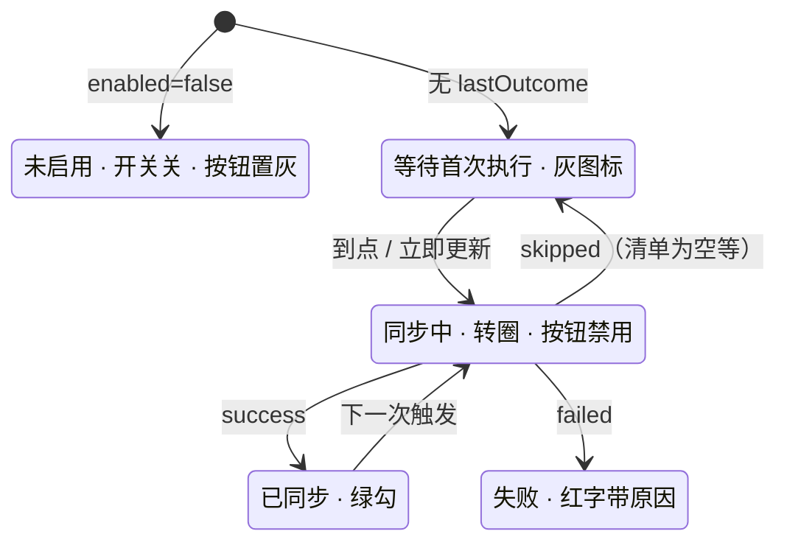

# 清单标的盘中自动更新（设备侧 · 东财直连）

## 1. 它是什么 / 在哪

**一句话职责**：在交易日四个时刻，把「App 内用户自己维护的 6 类清单」标的的当日K线从东财公开接口拉下来写入增量库，
经热刷新链路驱动条件单 / 预警重扫。**全程不依赖 PC。**

| 文件 | 角色 |
| :--- | :--- |
| `Kline/Data/WatchlistSymbols.swift` | 6 类清单 → `file` 集合（`SH#600000`）的唯一入口 |
| `Kline/Infrastructure/EastmoneyQuoteFetcher.swift` | 东财取数（分批 / 重试 / secid 映射 / 交易日换算） |
| `Kline/Infrastructure/WatchlistSyncManager.swift` | 编排 + 状态发布（面板消费） |
| `Kline/Data/LiveDataStore.swift` `upsertDaily` | 内存写入增量库（该文件另一入口是文件级 `mergeBucket`） |
| `Kline/Infrastructure/TdxSyncConfig.swift` | 四时刻表 + 开关（UserDefaults） |
| `Kline/Profile/LocalUpdateView.swift` | 面板展示 + 「立即更新」 |

调用关系：`WatchlistSyncManager.sync` → `WatchlistSymbols.unionFiles` → `EastmoneyQuoteFetcher.fetch`
→ `LiveDataStore.upsertDaily` → 既有热刷新链；由 `TdxSyncManager.checkSchedule` 在到点时**并行**触发（与云端同步独立、互不影响成败）。

## 2. 行为机制

### 2.1 一次同步做什么

从 `[A]` 起读；`E` 是唯一会产生副作用的节点。

**图里没画出来的部分**：
- **并集为空会在 `A` 之后直接结束**：记状态「跳过：清单为空」，不写库、不报错（这是正常的空态，不是故障）。
- `B` 内部还有一层：先做 `file → secid` 映射，映射不到的（如 25 只 `27#HS*` 恒生系不在覆盖表）逐条记为 `unmappable` 并跳过，**不中断**。
- `C` 会丢掉三类数据：`f124` 缺失（无法判定交易日）、OHLC 含 `-`/null、接口根本没返回该 secid。每类都带原因记入 `skipped`。
- `D` 里如果所有行都与库里一致，会**完全跳过事务**（见 §4 那条陷阱），此时 `E` 不会被触发。

### 2.2 四种状态与它们的外观

从 `[*]` 起读；状态 id 是 ASCII，中文是描述行。`syncing` 与 `failed` 是过渡态，其余是稳定态。

**图里没画出来的部分**：
- `skipped` 会被归到 `s1`（UI 的 `idle` 态）+ 文案呈现，不是独立态。
- 每个时刻行另有自己的「最近结果」文案（`slotResults[时刻]`），与整体状态是两个维度。
- 盘中快照语义是**按时刻名判定**的（< 15:00 视为盘中快照），与写入内容无关。

### 2.3 四个时刻与门禁

- 默认 `["11:00", "14:30", "15:05", "17:30"]`（`TdxSyncConfig.defaultScheduleTimes`）。
- **11:00 / 14:30 写的是当日未完成K线**（面板标「盘中快照」），15:05 / 17:30 才是完整K线。
- 门禁**复用** `TdxSyncConfig.enabled`（默认 true）与 `tradingDaysOnly`，**没有新增开关**。
- 非交易日不触发；App 不在前台则跳过该时刻，回前台补跑一次；同一时刻重复触发会被去重。
- **老用户一次性迁移**：`scheduleTimes` 持久化在 UserDefaults，已装机用户会读回旧的三档值；初始化时若存档值**恰好等于**旧默认三档，才替换为四档并落盘；用户自定义过的值不动。旧默认值常量留在 `TdxSyncConfig.legacyDefaultScheduleTimes`。

## 3. 关键决策（为什么这么写）

- [[20260922-行情同步-设备侧直连东财而非PC代取]] — 清单只存在设备上，PC 代取会遇到鸡生蛋
- [[20260922-行情同步-内容未变必须跳过事务而非依赖指纹比对]] — 否则空跑一次也会让条件单全量重扫

## 4. 已知陷阱

- [[20260922-INSERT OR REPLACE写同值也改页导致空跑自增dataVersion]] — 这是 `upsertDaily` 必须做写前判定的唯一原因
- [[20260922-gitignore的txt通配吞掉Bundle资源]] — 扩展指数覆盖表是普通 `.txt`，差点进不了 Bundle

## 5. 亮点 / 可复用的做法

- **清单并集的键选择**：自选/分组/置顶存的是 `Int` metaID，预警/条件单/委托存的是 `code` 字符串。归一全部**以主库 `meta` 表为唯一基准**建 `metaID → file` 与 `code → file` 双字典；后者只作 fallback，且**同码不同 file 的键直接丢弃**并记日志——因为主库 `code` 有 55 处重复（如 `62#000995` 与 `SZ#000995`）。
- **什么都从 `file` 出发**：全链路（取数、写库、合并、补丁）的键都是 `SH#600000` 这种 `file`，`code` 从不做键。
- **失败逐条记录而非整体失败**：单批请求失败、单只映射不到、单条数据无效都不影响其余，失败原因分类枚举，面板可展示样例。
- **不新增触发机制**：写完只调既有的 `_refreshAfterInternalWriteLocked`，条件单/预警重扫是免费获得的（见 [[行情同步架构总览]] §6）。
- **映射与取数解耦**：`secid(forFile:)` 是纯函数（特例表 → 前缀规则 → 覆盖表），覆盖表读不到就降级为「只用前缀规则」并记日志，不会崩。

## 6. 可调参数（改需求先来这里）

| 参数 | 位置 |
| :--- | :--- |
| 四时刻默认值 | `TdxSyncConfig.swift:45`（旧默认 :49，属性 :76） |
| 东财 URL 与字段列表 | `EastmoneyQuoteFetcher.swift:108` |
| 每批 secid 数 `ulistBatch = 100` | `EastmoneyQuoteFetcher.swift:110` |
| 超时 / 重试 / 批间隔 | 同上 :113 `requestTimeout=20`、:114 `maxAttempts=4`、:116 `retryBaseDelay=0.5`、:118 `batchInterval=0.25` |
| 扩展指数覆盖表资源名 | 同上 :124（文件 `Kline/Resources/universe_secids.txt`，源在 `src/data/universe_secids.txt`） |
| 内容比对容差 `upsertEpsilon = 1e-6` | `LiveDataStore.swift:897` |
| UserDefaults keys | `TdxSyncConfig.swift:57-61`、`TdxSyncManager.swift:137-143` |

## 7. 遗留 / 未验证

- [ ] 四时刻到点与面板四态在真机上的实际表现
  - **怎么验**：进入 个人中心 → 本地更新 → 「清单标的自动更新」子区；点「立即更新」看状态流转与四个时刻行标题
  - **谁来验**：必须用户真机（外观、文案）
- [ ] 条件单 / 预警是否随新价真触发
  - **怎么验**：给并集内标挂「价格上穿 X」条件单 + 一个预警，触发一次拉取后看是否产生对应记录
  - **谁来验**：必须用户真机（业务行为）
- [ ] 90 只跨市场样本（含扩展指数）能否取到当日 OHLC + 成交量 + 成交额
  - **怎么验**：清单里放 1 只 `27#`/`62#`/`102#` 扩展指数，触发拉取后查日志 `[EMQuote] 完成：… 命中 M / 跳过 K`，并确认扩展指数是否落在命中里
  - **谁来验**：必须用户真机（需真实网络与清单）
- [ ] `27#HS*` 恒生系 25 只仍无 secid 映射
  - **怎么验**：看日志中的 `unmappable` 样例是否包含它们
  - **谁来验**：AI 可自验（清单里放一只 `27#HSI` 跑一次）；补表需用户决定