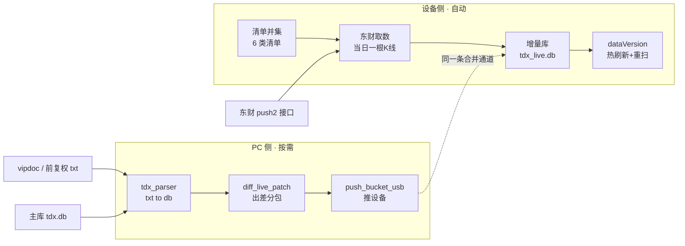
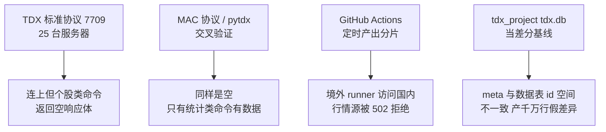

# 行情同步架构总览（Kline 增量行情）

## 1. 它是什么 / 在哪

**一句话职责**：把行情数据「补进」设备上那个 1.38GB 的整库 `Documents/tdx.db` 之外的增量层，
让自选 / K线图 / 条件单 / 预警在不重启 App 的前提下看到新价。

两层数据的分工（这是理解全部设计的前提）：

| 层 | 文件 | 内容 | 更新方式 |
| :--- | :--- | :--- | :--- |
| 主库 | `Documents/tdx.db` | 全市场 3611 只、日线 1400 万行、1.38GB | **仍手动整库替换 + 重启**（本链路不动它） |
| 增量库 | `Documents/tdx_live.db` | 按 `(file, date)` 存的新行，**查询时优先于主库** | 自动（三条通道） |

**角色关系**——从 `[清单并集]` 起读：设备侧完全自闭环（不依赖 PC），PC 侧只在复权改写/缺口补齐时介入。

**图里没画出来的部分**：
- 设备侧那条链是**四时刻定时**触发的（11:00 / 14:30 / 15:05 / 17:30），不是人点出来的。
- PC 侧那条链**没有定时**，由用户在通达信客户端补完缺口后手动跑三步。
- `G` 推的差分包与 `C` 走的是**同一个合并入口**（`LiveDataStore.mergeBucket`），差别只在包内日期可跨任意历史。

**关键文件与调用关系**

| 文件 | 角色 | 谁调谁 |
| :--- | :--- | :--- |
| `Kline/Data/LiveDataStore.swift` | 增量库读写层（合并/内存写入/裁剪/指纹/reload 发布） | 被 TdxSyncManager、WatchlistSyncManager、KlineHTTPServer、MainDBMerger 调 |
| `Kline/Data/DatabaseManager.swift` | 主库读写 + `dataVersion`（:44-49 订阅、:54-67 自增） | 被各处读 |
| `Kline/Infrastructure/TdxSyncManager.swift` | 云端 manifest 分片同步编排（缺口取片 / 补丁 / 裁剪 / 热刷新） | 调 LiveDataStore、DatabaseManager |
| `Kline/Infrastructure/WatchlistSyncManager.swift` | 清单并集 → 东财 → 写增量库 编排 | 调 WatchlistSymbols / EastmoneyQuoteFetcher / LiveDataStore |
| `Kline/Infrastructure/EastmoneyQuoteFetcher.swift` | 东财当日K线取数（设备直连） | 被 WatchlistSyncManager 调 |
| `Kline/Data/WatchlistSymbols.swift` | 6 类清单并集 → `file` 集合的唯一入口 | 被 WatchlistSyncManager 调 |
| `Kline/Infrastructure/TdxSyncConfig.swift` | 同步配置（源/时刻/开关，UserDefaults） | 被两个 Manager + UI 读 |
| `Kline/Infrastructure/KlineHTTPServer.swift` | 5051 端口 HTTP：IPA 安装 + 沙盒读写 + 同步端点 | 被推送脚本 / UI 调 |
| `Kline/Profile/LocalUpdateView.swift` | 「本地更新 / 数据同步 / 清单自动更新」UI | 调各 Manager |
| `Kline/Data/MainDBMerger.swift` | 增量库 → 主库 UPSERT（「合并到 tdx.db」按钮） | 被 LocalUpdateView 调 |

---

## 2. 路径矩阵：走通 / 走不通 / 已废弃

这张表是本模块最该先看的东西——**别去复活已经死掉的路径**。

### 2.1 走通（在用）

| 路径 | 触发 | 关键入口 |
| :--- | :--- | :--- |
| **设备侧清单自动更新**（主路径） | 四时刻 / 回前台补跑 / 手动 | `WatchlistSyncManager.sync` → `EastmoneyQuoteFetcher.fetch` → `LiveDataStore.upsertDaily` |
| **PC 出差分包推设备** | 用户手动三步 | `tdx_parser.py --rebuild` → `diff_live_patch.py` → `push_bucket_usb.py` |
| **PC 直推当日分片** | 用户手动 | `build_live_buckets_pc.py` → `push_bucket_usb.py`（唯一覆盖 3611/3611，含 299 扩展指数） |
| **USB / 局域网整文件替换手工兜底** | 用户手动 | `PUT /sandbox/...` + `POST /sync/reload` |
| **增量写回主库** | 用户在面板点「合并到 tdx.db」 | `MainDBMerger`（单事务 + 二次确认） |

### 2.2 走不通（实现了，被外部条件挡死）

从 `[T1]` 起读；每行「想做的 → 实际撞到的墙」。

**图里没画出来的部分**：
- `T1` 的 `get_security_count` 是**正常返回**的（沪 27472 / 深 24296）——所以这不是网络拦截，而是服务端策略：统计类放行、个股行情类拒绝。
- `T4` 不是"墙"而是"脏数据"，现在的处理是**拒绝出包**（exit 3），不是绕过。
- `T3` 的 workflow 文件**仍在仓库里且未被禁用**，定时照跑照失败——见 §5。

| 想做的 | 撞到的墙 | 证据 |
| :--- | :--- | :--- |
| 用 TDX 标准协议直连取数 | 25 台服务器全部「连上但命令返回空」；`count<100` 与 `count≥100` 都空 | `build_logs/_tdx_probe.py`（探针源码，输出未落盘） |
| 用 pytdx 交叉验证 | 8 台同样模式：`bars` / `quotes` / `list` 全 `None`，但 `get_security_count` 正常 | `build_logs/_pytdx_probe.py` |
| 用 easy_tdx MAC 协议取日K | 连接握手成功、`get_stock_kline` / `get_stock_quotes` 全空 | 探针输出未落盘 |
| 用 easy-tdx `offline sync-all` | **该命令不存在**（误以为有；实际只有在线接口，且在线上也是空） | — |
| 云端 GitHub Actions 定时产出 | 境外 runner 访问国内行情源 502 | [spec.md](file:///c:/Users/sunck/home/projects/ios/Kline/.trae/specs/add-watchlist-intraday-sync/spec.md)「不采纳」段 |
| 拿 `tdx_project/tdx.db` 当差分基线 | 该库 `meta` 表按字母序重排（id 1..3611）、数据表却是 id 3..3637 → 按 `file` 关联产 1231 万行假差异 | `diff_live_patch.py` 的 `check_meta_consistency` 实测拦下 |

### 2.3 已废弃 / 被取代（别再照着旧文档做）

| 旧物 | 现状 | 取代者 |
| :--- | :--- | :--- |
| `push_live_usb.py` / `push_live_lan.py` 的 **CLI 主路径** | **死**：它们找 `build_logs/live/tdx_live.db`，而 `live_db_builder.py` 现在只产 `bucket_<id>.db` + `manifest.json`（已无 `tdx_live.db` 产物），默认必报「找不到增量库」 | `push_bucket_usb.py`（推分片/补丁 + `/sync/merge-bucket`） 注：这两个文件的**传输模块**仍被 `push_bucket_usb.py` import 复用，别删 |
| `live_db_builder.py`「全市场枚举 + 逐标的历史补齐」(v2) | **已删**：`enumerate_market_symbols` 函数在源码中已不存在 | `universe.txt` 清单 + `build_live_buckets_pc.py` |
| `build_logs/cache_market.py` | **死码**：调用的 `L.enumerate_market_symbols()` 已不存在 | — |
| schema 1 路径：整文件下载 + 原子替换 `tdx_live.db` | **事实死分支**：只在 `manifest.isSharded == false` 时可达，而现行 manifest 是 schema 3（`buckets` 非空 → `isSharded` 恒 true） | 分片 + `/sync/merge-bucket` |
| schema 2 的「14 天一片 / 保留 10 片」 | **死字段 + 死描述**：`TdxSyncManager.swift:65` 的 `bucket_days` 无人读取；设备端也没有 10 片常量（是 `maxBucketSelection = 30`） | schema 3 日分片 + `KEEP_BUCKETS = 30` |
| `src/data/symbols.txt` | 遗留调试小清单，生产不读 | `src/data/universe.txt` |
| `live_db_builder.py --offline` | 仅联调/结构校验用的合成数据模式 | — |
| `migrate_tdxdb.py`、`inspect_seed_db.py` | 一次性任务，已完成 | — |
| [Kline-增量行情库自动同步.md](file:///c:/Users/sunck/home/projects/ios/Kline/.trae/documents/Kline-增量行情库自动同步.md) | **正文已过时**：描述的是 schema 2 / 14 天片 / 云端 Actions 为默认方案 / 111 B 每根K线 | 本篇 + 本目录其它篇 |

`build_logs/_*.py` 那批一次性探针（`_tdx_probe`、`_pytdx_probe`、`_read_day`、`_emit_secids`、`_probe_ext*`、`_run_today`、`_serve_today`、`_push_today`、`_export_universe`、`_pcmeta`、`_schema`）**不属仓库跟踪的废弃代码**——`build_logs/` 在 `.gitignore` 里。

---

## 3. 实测数据（已校准，不要再用估值）

| 量 | 实测值 | 怎么测的 |
| :--- | :--- | :--- |
| USB 上传吞吐 | **10.74 / 11.70 MB/s** | 64MB 样本 PUT 两次 |
| 全量推送 1.38GB（外推） | **≈123 秒（2.05 分钟）** | 按 11.2 MB/s 外推，与历史记录 2-4 分钟吻合。**且整库替换必须重启 App** |
| 单日分片（3312 只） | **576 KB** | `bucket_20718.db` |
| 差分每行成本 | **93.9 B/行** | 实测包 23,592,960 B ÷ 251,849 行 |
| 常态差分包 | 约 **10.2~10.9 MB**（22~24 只整段重灌） | 按上两行推算 |
| 差分生成耗时 | **400 秒**（6.7 分钟） | 1.4GB 库对全跑：sha256 14.5s + 自洽性 37.4s + 扫描出包 386.7s + 复核 13.3s |
| 设备合并 22.5MB / 251,849 行 | **1.3 秒** | `MERGE patch_2.db HTTP 200 1.3s` |
| 设备合并 576KB / 3303 行 | **0.1 秒** | `MERGE bucket_20718.db` |
| 除权除息频次 | 常态 **22~24 只/交易日**（分红季峰值上百只） | 本机 gbbq `category==1` 统计：2025 全年 5547 次 |

关键换算：**每天要传的量从 1.38GB 降到约 10MB（1/140）**，代价是 PC 侧每次生成要 6.7 分钟（盘后任务，可接受）。

---

## 4. 关键决策（为什么这么写）

- [[20260922-行情同步-设备侧直连东财而非PC代取]] — 清单只存在设备上，PC 代取会遇到鸡生蛋
- [[20260922-行情同步-差分对比用db而非txt]] — 复用唯一一份解析实现，避免两套漂移
- [[20260922-行情同步-差分包不受KEEP_BUCKETS约束]] — 复权改写跨任意历史日期，分片契约装不下
- [[20260922-行情同步-内容未变必须跳过事务而非依赖指纹比对]] — 指纹比对救不了「写同值也改页」
- [[20260922-行情同步-基线必须是自洽整库拷贝]] — 不自洽的库按 file 关联会产千万行假差异

## 5. 已知陷阱

- [[20260922-INSERT OR REPLACE写同值也改页导致空跑自增dataVersion]] — 空跑一次也会让条件单全量重扫
- [[20260922-last_size增量永久漏掉复权改写的历史行]] — 导入端的增量机制与复权语义天然冲突
- [[20260922-基线库meta与数据表id空间不一致产千万行假差异]] — 换基线前必须先跑自洽性校验
- [[20260922-gitignore的txt通配吞掉Bundle资源]] — 新增文本资源后 App 读不到，且本地无感
- [[20260922-TDX协议公共服务器拒绝匿名个股数据]] — 别再把 TDX 协议当日K主线
- [[20260922-境外Actions访问国内行情源被502拒绝]] — 云端定时要挑能落地的方案

---

## 6. 亮点 / 可复用的做法

- **一个包契约服务两种语义**：分片（一日一片、受 30 片约束）与补丁（任意历史日期、不受约束）共用同一张表结构和同一个合并入口。设备侧合并逻辑对包内日期**不做任何校验**，所以承载复权重灌零改动。见 `LiveDataStore.swift:720`。
- **两条写入口按数据来源分工**：文件来的走 `mergeBucket(atPath:)`（ATTACH 分片），内存来的走 `upsertDaily`（绑定写入）。后者额外带「写前判定」守卫。
- **热刷新只有一条链**：`写入 → _refreshAfterInternalWriteLocked → reloadAsync → 内容变化判定 → dataVersion += 1 → 消费方`。新功能只要走这条链，监控触发就免费获得，不需要新增触发机制。
- **生成端与设备端共用一个 `line` 口径**：东财 `f124` 按北京时间换算交易日，两端都显式写 `UTC+8`，**都不允许用本机日期**，因此非交易日不会造假日K线。
- **PC 侧脚本一律只读主库**：`mode=ro` + `PRAGMA query_only=1`，且跑完复核 sha256/mtime/size，把「读数据别把数据读坏」变成可验证的硬约束。

## 7. 遗留 / 未验证

- [ ] 四时刻到点触发、面板四态与盘中快照标注在真机上的表现
  - **怎么验**：个人中心 → 本地更新，看「清单标的自动更新」子区四个时刻行标题是否为 `11:00 · 盘中快照` / `15:05 · 收盘`；点「立即更新」看状态是否从「同步中」转到「已同步」
  - **谁来验**：必须用户真机（外观、文案）
- [ ] 条件单 / 预警是否真的随新价触发
  - **怎么验**：给并集内某标的挂「价格上穿 X」条件单 + 一个预警，触发一次拉取后看是否产生对应记录
  - **谁来验**：必须用户真机（业务行为）
- [ ] 重复拉取同一快照时 `dataVersion` 是否真的不自增
  - **怎么验**：联系两次「立即更新」，查 `Documents/debug_log.txt` 第二次是否**没有** `[DB] dataVersion → n`
  - **谁来验**：必须用户真机（行为时序）
- [ ] `tdx_parser.py --rebuild` 对已除权标的的历史是否与 txt 逐行一致
  - **怎么验**：先增量跑一次、再 `--rebuild` 跑一次，比对某已除权标的的历史价格
  - **谁来验**：用户（在通达信客户端全量更新时一并做）
- [ ] 云端 `sync-live-db.yml` 仍在定时跑且必然失败
  - **怎么验**：看仓库 Actions 页面该 workflow 的近期 run 结论
  - **谁来验**：AI 可自验（一次 `gh run list`）；清理动作需用户决定（删 workflow 还是留着当占位）