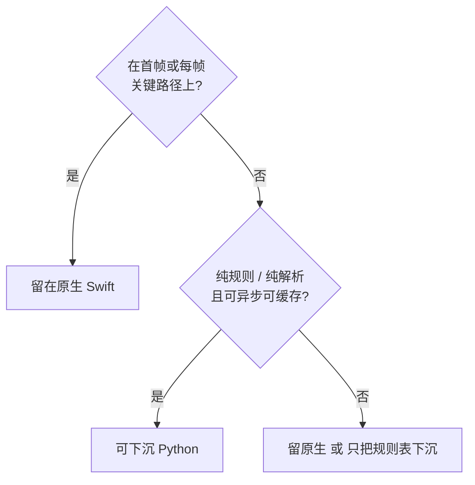
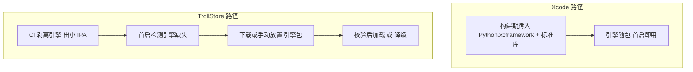

# 假定捆绑 Python3 引擎：功能下沉可行性与选型分析

> 本文档为分析交付物。分析对象为 Kline 项目当前代码；本文档不含任何代码改动。

## Why

当前 Kline 项目约 **4.9 万行 Swift（149 个文件，不含空行）** 承担了从图表渲染、指标计算、公式解析到数据摄取与同步的全部职责；同时仓库已有约 **4400 行 Python**（`src/` 的 PC 侧数据管线 + `check_indicators.py` 编译期校验）在实现**同一批口径**——周期聚合规则、东财取数字段序号、`.tdx` 指标模板解析。

两套实现目前靠源码注释里的「改这里前先读那边」维持一致，已经出现明确的漂移风险点。本分析回答：假定必须在 App 内捆绑 Python3 引擎，**哪些功能下沉更合适**（可读性 / 可维护性 / 版本更新灵活性 / 避免造轮子四维，**外加一条「通用性」判据**，见 §2.1）、**哪些必须留原生**，以及「Xcode 内嵌 + CI 剥离 + 运行时获取」双路径方案**是否可行**。

除「下沉已有功能」外，本版还评估了**两个仓库里尚不存在的新能力**——通用数学栈（§3.6.2）与 K 线形态识别（§3.6.3），因为它们是「Swift 只是壳」这条架构意图下最典型的受益者。

---

## What Changes

- `spec.md` 承载分析全文（本文档）。
- 实施阶段新增**一个**文档文件：`.trae/documents/python-engine/Python引擎下沉可行性分析.md`，内容即本文档正文。
- 实施阶段按 `checklist.md` 逐条自检，并按 `mermaid-doc-convention` 校对两张配图。
- **不包含**：任何 Swift / Python 源码改动、`project.pbxproj` 改动、`.github/workflows/*` 改动、`Python.xcframework` 的引入或下载。

## Impact

- Affected specs: 无（新建，纯分析交付物，无能力变更）
- Affected code: **无代码改动**。分析对象为 `Kline/`（149 个 Swift 文件）、`src/`（5 个 Python 模块）、`check_indicators.py`、`.github/workflows/`、`Kline.xcodeproj/project.pbxproj`、`Kline.entitlements`

---

## 一、现状基线

### 1.1 Swift 侧运行时承担的计算类职责

| 职责 | 文件 | 行数 | 算法一句话 |
| --- | --- | --- | --- |
| TDX 公式引擎 | [FormulaEngine.swift](file:///c:/Users/sunck/home/projects/ios/Kline/Kline/Formula/FormulaEngine.swift) | 1570 | 手写词法 → 递归下降语法 → 求值；**22 个具名内置函数**（另 3 个小写别名、11 个序列键）；支持**分块增量求值**（递归指标跨块续算） |
| 指标预计算与跳空缺口 | [IndicatorPipeline.swift](file:///c:/Users/sunck/home/projects/ios/Kline/Kline/Chart/IndicatorPipeline.swift) | 1013 | 前台近似（可见 100 + 预热 50 ≈ 150 根）+ 后台按 500 根/块向历史推进，覆盖到可见窗口末端后替换近似值；缺口用维护 pending 列表的线性扫描 |
| 回测引擎 | [StrategyBacktestEngine.swift](file:///c:/Users/sunck/home/projects/ios/Kline/Kline/Backtest/StrategyBacktestEngine.swift) | 854 | 逐 bar 推进，T+1 / 涨跌停 / 费率口径；网格与分批状态机；复用 `StrategyCondGenerator.drafts` 与 `SimCondRule` 口径 |
| 条件单结算（含预警） | [SimCondEngine.swift](file:///c:/Users/sunck/home/projects/ios/Kline/Kline/Trading/SimCondEngine.swift) + [SimCondRule.swift](file:///c:/Users/sunck/home/projects/ios/Kline/Kline/Trading/SimCondRule.swift) + [SimCondKit.swift](file:///c:/Users/sunck/home/projects/ios/Kline/Kline/Trading/SimCondKit.swift) | 308 + 424 + 124 | 行情刷新时结算全部 monitoring 条件单：重入保护 → 有效期 → 快照 → 纯函数判定 → 组装委托。**「仅提醒」（预警）是同一引擎的 `isAlertOnly` 形态，不是独立引擎** |
| 模拟交易规则 | [SimTradingRules.swift](file:///c:/Users/sunck/home/projects/ios/Kline/Kline/Trading/SimTradingRules.swift) | 158 | T+1 / 整手 / 佣金 / 印花税 / 涨跌停 / 交易时段的集中规则表与校验；注释明写「规则层是纯计算，校验失败不产生任何数据写入」 |
| 东财取数 | [EastmoneyQuoteFetcher.swift](file:///c:/Users/sunck/home/projects/ios/Kline/Kline/Infrastructure/EastmoneyQuoteFetcher.swift) | 432 | 批量快照（≤100 secid/批）；secid 前缀映射；f17/f15/f16/f2 取 OHLC；f124 按 UTC+8 换算交易日；指数退避重试 |
| 分片同步 | [TdxSyncManager.swift](file:///c:/Users/sunck/home/projects/ios/Kline/Kline/Infrastructure/TdxSyncManager.swift) | 872 | manifest v3 日分片：按主库缺口选相交分片（≤30 片）→ 逐片下载 → sha256 校验 → 合并 → 单次热刷新 |
| 增量库读写 | [LiveDataStore.swift](file:///c:/Users/sunck/home/projects/ios/Kline/Kline/Data/LiveDataStore.swift) | 1127 | 五表增量库；按 `file` 建键；分片合并 / **周期感知裁剪**；指纹（size+mtime+sha256）轮询 |
| 主库合并 | [MainDBMerger.swift](file:///c:/Users/sunck/home/projects/ios/Kline/Kline/Data/MainDBMerger.swift) | 272 | 单事务 `BEGIN IMMEDIATE` + 预编译 `INSERT OR REPLACE`，按 `(meta_id,date)` UPSERT 并同步 `meta.last_date` |
| 清单自动更新编排 | [WatchlistSyncManager.swift](file:///c:/Users/sunck/home/projects/ios/Kline/Kline/Infrastructure/WatchlistSyncManager.swift) | 291 | 清单并集 → 东财取当日 K 线 → 直写增量库；并用「主库当期 bar ⊕ 新日线」合并出当期季/年 bar |
| 本地 HTTP 服务 | [KlineHTTPServer.swift](file:///c:/Users/sunck/home/projects/ios/Kline/Kline/Infrastructure/KlineHTTPServer.swift) | 1707 | Network.framework 手写 HTTP，前台监听 5051；暴露 Downloads 目录 IPA 供 TrollStore 安装 |
| 指标模板解析 | [SystemIndicatorStore.swift](file:///c:/Users/sunck/home/projects/ios/Kline/Kline/Formula/SystemIndicatorStore.swift) | 251 | 解析 `Kline/Indicators/*.tdx` 的 NAME / SCOPE / GROUP / FORMULA |
| 策略 DSL | [StrategyFormula.swift](file:///c:/Users/sunck/home/projects/ios/Kline/Kline/Formula/StrategyFormula.swift) + [FormulaKind.swift](file:///c:/Users/sunck/home/projects/ios/Kline/Kline/Formula/FormulaKind.swift) | 617 + 348 | 策略文档 TRADE / RULES 段的解析与展开 |
| 图表渲染与交互 | `Kline/Chart/*`（18 文件） | 8515 | 主副图绘制、十字光标、手势识别、惯性动画、图例与数据栏 |
| SQLite 查询层 | [DatabaseManager.swift](file:///c:/Users/sunck/home/projects/ios/Kline/Kline/Data/DatabaseManager.swift) | 348 | `dbQueue` 串行访问；meta 加载；五周期查询；`dataVersion` 驱动热刷新 |
| 布局 schema | [PageLayoutSchema.swift](file:///c:/Users/sunck/home/projects/ios/Kline/Kline/App/PageLayout/PageLayoutSchema.swift) + [PageLayoutCodec.swift](file:///c:/Users/sunck/home/projects/ios/Kline/Kline/App/PageLayout/PageLayoutCodec.swift) | 474 + 46 | 页面/组件布局的声明式模型与 JSON 编解码 |

### 1.2 PC 侧 Python 模块

| 文件 | 行数 | 用途 | 第三方依赖 |
| --- | --- | --- | --- |
| `src/tdx_parser.py` | 754 | 通达信 txt → SQLite 全量导入；定义五表 + meta 表结构；`period_key` 周期键与周期聚合 | **无**（`sqlite3/os/re/sys/time/threading/platform/datetime`） |
| `src/txt_patch_builder.py` | 1080 | 新 txt 目录 + 基线库 → `patch_<seq>.db`；区分 append / rewrite / new 三类差分 | **无** |
| `src/live_db_builder.py` | 1131 | 日分片增量库生成；东财批量快照取数；secid 映射；manifest + bucket + `.changed` | **无**（含 `urllib`） |
| `src/txt_changes.py` | 282 | 新旧 txt 目录变更判定（stat / content / bc 三种 mode），全项目唯一一份实现 | **无**（含 `hashlib/subprocess/xml.etree`） |
| `src/tdx_gui.py` | 1071 | PC 侧 GUI 操作入口 | **PySide2**（Qt 绑定，全项目唯一第三方依赖） |
| `check_indicators.py` | 103 | **编译期**校验 `.tdx` 模板；复刻 `SystemIndicatorStore.parse()` 的解析规则 | **无** |

> 关键事实：**承载口径逻辑的五个数据模块全部为标准库实现，没有 pandas / numpy / requests**；全项目唯一的第三方依赖是 GUI 壳 `src/tdx_gui.py`（PySide2），它不承载任何口径规则。这直接影响「避免造轮子」这一维度的兑现方式——见 §3.5。

### 1.3 构建 / 签名 / 打包现状

- **编译期已在使用 Python**：`project.pbxproj` 存在 `Check Indicators` Run Script 阶段，脚本为 `python3 "$SRCROOT/check_indicators.py" "$SRCROOT/Kline/Indicators"`。这条跑在**构建机的 macOS 上**，与「App 内捆绑引擎」是两回事。
- **工程结构**：`Kline` 是 `PBXFileSystemSynchronizedRootGroup`（文件自动同步，无需手工加 pbxproj 条目）；`Indicators/*.tdx` 通过 `membershipExceptions` 排除出编译、作为资源。
- **CI（`.github/workflows/build.yml`）**：unsigned `xcodebuild`（`CODE_SIGNING_ALLOWED=NO`）→ 交叉编译并嵌入 `rootprobe` / `opener` 两个 root helper → `codesign -f -s - --entitlements Kline.entitlements` 对主二进制与 helper 做 ad-hoc 签名 → 打包 `.ipa` → 发布到 `latest` Release 作为 App 内远程更新的下载源。
- **`Kline.entitlements` 实际键值**：`com.apple.private.security.no-sandbox`、`platform-application`、`com.apple.private.security.storage.AppDataContainers`、`com.apple.private.persona-mgmt`。
- **关键否定事实**：**CI 当前不存在任何 `TROLLSTORE` 之类的条件打包分支**，也没有剥离/条件拷贝任何资源的逻辑；工程内无 embedded framework、无 SPM / CocoaPods 依赖（`Frameworks` build phase 为空）。仓库内 `tdx.db` 仅 0.9MB（种子库），设备上的主库是 1.4GB 量级。

### 1.4 `src/` 的定位（澄清一处前提，本版新增）

`src/` 下的五个 Python 模块**目前不打算放进 Kline App 内运行**；它们与 App 放在同一仓库，目的是**统一版本管理，避免两份版本管理各自漂移**。

这个前提对结论有实质影响，而且是**有利**的：

- 它意味着「同仓」目前只达成了**源码级统一**——两份实现仍在，靠人读注释对齐（`EastmoneyQuoteFetcher.swift` 头部那句「改这里前先读那边」正是这种对齐方式的写照）。
- 而**引擎下沉能达成运行时级统一**：App 侧的 Python 可以直接 `import` `src/tdx_parser.py` 里那份 `period_key` / 周期聚合，**同一份 `.py` 文件在两端执行**。这是「统一版本管理」的最终形态，也是本分析里**最强的下沉理由**——比「消除双实现」这个说法更准确：**它不是把 PC 代码搬进 App，而是让两端共用同一份源码。**
- 代价要说清：一旦 App 侧 import 了 `src/` 的模块，`src/` 就**不再是纯 PC 工具**，而是「两端共享库」，随之带来约束——GUI 壳（`PySide2`）必须与共享模块**物理隔离**、不能假设 PC 的文件系统布局、标准库版本要兼容 iOS 侧的 Python 版本。
- **好消息**：`tdx_parser.py` / `live_db_builder.py` / `txt_changes.py` 本来就无第三方依赖（已核实），天然满足共享前提；唯一带第三方依赖的 `tdx_gui.py` 恰好是纯 GUI 壳，隔离成本很低。

---

## 二、筛选判据

从 `[q1]` 起读：先问「是否在首帧或每帧关键路径」，再问「是否纯规则或纯解析」。

**图里没画出来的部分**：

1. 这只是第一道筛。命中「可下沉」后还要再过 §4 的「FFI 数据搬运量」与「引擎缺失时的降级能力」两道闸，三关都过才算推荐项。
2. 命中「可下沉」**不等于**本轮就该做——§6 结论区分「架构上更合适」与「现在值得做」。
3. 判据只作用于**运行时**职责；`check_indicators.py` 这类编译期脚本不在范围内（它已在构建机执行）。
4. **这张图不包含 §2.1 新增的「通用性」判据**——它是另一条独立的筛法，用文字给出更清楚，所以没有画进图里。

### 2.1 补一道判据：通用性（本版新增）

上面那张图筛的是「**能不能**下沉」，缺一道筛「**该不该**下沉」。这道判据来自一条明确的架构意图：

> Swift 只是壳。未来要支持更丰富的数学引擎，不想在 Swift 里重学一遍数学那一套；不要求一份代码编译出多平台产物，但**通用功能希望通用**。

按这条判据，职责先分成两层：

| 层 | 判据 | 归属 |
| --- | --- | --- |
| **通用计算层** | 换一个宿主（PC 脚本 / 服务端 / 另一个 App）后**原样还有用**：数学与统计、时序指标、公式求值、形态模式匹配 | 应下沉，且应做成可移植模块 |
| **平台外壳层** | 离开 iOS 就失去意义：渲染、手势、窗口、沙盒路径、后台调度、系统集成 | 留原生 |

这条判据与前一道**不冲突，但会重排候选**：它把候选 2（公式引擎）往上推，把候选 4（取数口径）往下推——后者版本灵活性最高，却**本质不通用**（绑死东财字段序号）。两个维度在候选 4 上方向相反，逐项重排见 §3.6.1。

---

## 三、候选功能评估（四维 + 通用性）

### 3.1 四维汇总表（「通用性」单列在 §3.6.1）

| # | 候选 | 可读性 | 可维护性 | 版本更新灵活性 | 避免造轮子 | 分级 |
| --- | --- | --- | --- | --- | --- | --- |
| 1 | 指标模板解析与校验 | 持平 | **强正** | 中 | 弱 | **推荐下沉** |
| 2 | TDX 公式引擎 | 略正 | 中 | 中 | **强正** | **推荐下沉（解析层 + 函数库）；首帧调度留原生**（§3.6.1 上调） |
| 3 | 周期聚合 | **强正** | **强正** | 中 | 中 | **推荐下沉** |
| 4 | 东财取数口径 | **强正** | **强正** | **强正** | 中 | **推荐下沉** |
| 5 | 策略 / 公式 DSL 解析 | 中 | 中 | 中 | 弱 | 中性 |
| 6 | 回测引擎 | 略正 | **强负** | 中 | 弱 | **不建议下沉** |
| 7a | 条件单 / 预警**判定层**（`SimCondRule` + `SimTradingRules` + `SimCondKit`） | 持平 | 中 | 中 | **零** | **中性偏不建议** |
| 7b | 条件单**副作用层**（`submit` / 委托 / 成交 / 资金流水 / 落盘） | 负 | 负 | 负 | 弱 | **不建议下沉** |
| 7c | 预警记录（`SimAlertRecord` 追加 / 保序裁剪 / 展示） | 持平 | 弱 | 弱 | 弱 | **不建议下沉** |
| 8 | SQLite 查询层 | 持平 | 弱 | 弱 | 弱 | **不建议下沉** |
| 9 | 本地 HTTP 自更新服务 | **强正** | **强负** | 负 | 中 | **不建议下沉** |
| 10 | 图表渲染与手势 | 负 | 负 | 负 | 负 | **不建议下沉** |
| 11 | 布局 schema 与编解码 | 持平 | 持平 | 弱 | 负 | **不建议下沉** |
| 12 | K 线形态识别（**新能力，仓库内暂无**） | **强正** | **强正** | 中 | **强正** | **推荐下沉**（§3.6.3） |
| 13 | 通用数学 / 统计函数库（**新能力，仓库内暂无**） | **强正** | **强正** | 中 | **强正** | **推荐下沉**（§3.6.2） |

「强正 / 略正 / 持平 / 弱 / 强负 / 负」= 该维度上下沉相对留原生的净收益方向与强度。

> 候选 12 / 13 与前面 11 项**性质不同**：前 11 项是「要不要把已有实现搬走」，12 / 13 是「这个新能力该建在哪一侧」。它们放在同一张表里是为了四维可比，但结论读法不同。

### 3.2 专项论证：公式引擎与回测引擎为什么分级不同

这两个候选最容易被质疑，单独说清。

**TDX 公式引擎（候选 2）——从「不建议」连升两级到「推荐下沉（解析层 + 函数库）」**

*支持下沉的理由：*
- **避免造轮子收益真实且最大**：`FormulaEngine.swift` 手写了 22 个具名内置函数（`MA/EMA/SMA/DMA/MEMA/REF/HHV/LLV/ABS/MAX/MIN/SUM/AVEDEV/SAR/STD/COUNT/IF/CROSS/BARSLAST/AND/OR/NOT`）及其增量版本。Python 侧 `MyTT`（单文件、按通达信口径实现）、`pandas-ta`、`TA-Lib` 已覆盖其中大部分，这是本项目中唯一能**实质减少自研代码量**的候选。
- **解析规则已存在双实现**：`check_indicators.py` 明确写着「校验逻辑与 App 内 `SystemIndicatorStore.parse(content:id:)` 保持一致」——单一事实源收益。
- 公式本身是数据（`.tdx` 文件），解析器天然适合脚本语言。
- **它有不止一个消费者（本版补充）**：公式引擎目前被**三处**调用，所以下沉的收益面比上一版描述的大：
  1. 图表指标：[IndicatorPipeline.swift](file:///c:/Users/sunck/home/projects/ios/Kline/Kline/Chart/IndicatorPipeline.swift) → `TDXFormulaEngine.evaluate`；
  2. **表头筛选公式列**：[MarketRowCache.swift L292](file:///c:/Users/sunck/home/projects/ios/Kline/Kline/Market/MarketRowCache.swift#L292) 的 `matchFormula` → `TDXFormulaEngine.evaluate`（用于选股 / 筛选命中判定）；
  3. 策略 DSL：`StrategyFormula` → 回测。
- **通用性判据（§2.1）把它往上推**：一个 DSL 求值器 + 内置函数库**与平台无关**，换到 PC 脚本、服务端都原样可用，正是「Swift 只是壳」想要的那类资产。这条判据是本次分级上调的直接原因。

*不支持整体下沉的理由（都不是「能力问题」，而是两个具体工程约束）：*
- **首帧路径**：`IndicatorPipeline` 的设计是「前台先算可见 100 + 预热 50 ≈ 150 根立即显示，后台按 500 根/块用正确覆盖替换近似值」。这 150 根落在用户打开标的的那一帧上。引入解释器后，这一段要额外付解释器调用开销，甚至 numpy import 开销。
- **跨语言状态机**：后台分块之所以便宜，靠的是 `TDXIncrementalState` 把 EMA/SMA/DMA/MEMA 等递归指标的块末值跨块续算（`resumingMain` / `resumingSubs`），并且 `TDXSharedSeries` 让各块**共享引用**避免重复 map。跨 FFI 时这个状态要序列化、共享数组要变拷贝，是实打实的复杂度。

*因此建议的切法*：**下沉「解析 + 内置函数库」，留原生「首帧近似 + 分块增量调度」**。或者更彻底：Python 只做**整序列批量计算**（后台、vectorized、可缓存），原生仅保留首帧近似这一小段标量代码——注意这段近似**今天就已经与「正确值」不一致**（这是既有设计，不是 Python 引入的漂移）。

*阈值化条件*：若 Phase-0 实测「Python 计算 150 根 + 桥接往返」耗时落在可接受阈值内，则首帧调度也可一并下沉，**全引擎可整体搬走**。这是个可被实测推翻的判断，不是定论——但请注意：即使实测不达标，**解析层与函数库仍然应该下沉**，因为那部分本来就不在首帧路径上。这是本版把它从「中性」上调为「推荐下沉」的关键：**上调不依赖任何未验证的假设**。

**回测引擎（候选 6）——维持「不建议下沉」，但理由要换成语义一致性**

先纠正一个不准确的理由：**不是性能问题**。回测不是逐 bar 跨 FFI，标准做法是整段 bar 数组一次传入、净值曲线一次返回，这个形状很干净；而且它本身就是 `nonisolated`、不碰 `DatabaseManager` / `MarketRowCache` / `SimStore`、文档明写「纯函数，同参数重复调用结果一致」——**这恰恰是最适合下沉的形状**。

真正的阻断点是**语义一致性**，证据在代码里：

- [StrategyBacktestEngine.swift](file:///c:/Users/sunck/home/projects/ios/Kline/Kline/Backtest/StrategyBacktestEngine.swift#L36-L43) 的规则映射「沿用同一张映射表，不重复实现」，直接调用 `StrategyCondGenerator.drafts`；
- [同文件 L736-L755](file:///c:/Users/sunck/home/projects/ios/Kline/Kline/Backtest/StrategyBacktestEngine.swift#L736-L755) 复用 `SimCondRule.gridLevelCount`（注释「不重复实现」），`batchQty` 则是**同口径重写**（注释「与 `SimCondRule.batchQty` 同口径」）——两者都是「必须与实时结算一致」的显式声明；
- [同文件 L339](file:///c:/Users/sunck/home/projects/ios/Kline/Kline/Backtest/StrategyBacktestEngine.swift#L339) 注释「止损腿优先（与 `SimCondRule.evaluate` 同序）」。

也就是说，回测引擎与实时条件单引擎（候选 7）是**刻意做成的「一套语义、两个执行器」**：回测 = 历史回放，`SimCondEngine` = 实时结算。若只把回测搬到 Python，就会得到「实时在 Swift、回放在 Python」的**两套交易语义**——这正是仓库目前在数据口径上极力避免的漂移，但落在**交易语义**上，分歧的代价是错的委托，而不是偏旧的数据。

结论：候选 6 与候选 7 是**成对**的——要下沉就成对下沉。而这一对能否成立，取决于候选 7 判定层的信任代价是否可接受，见下一节。

### 3.3 专项论证：条件单与预警（为什么不能按「预警 / 条件单」切）

**先纠正一个前提：预警不是独立引擎。** 预警是条件单的一个**形态**——`SimCondDirective.isAlertOnly`（[SimConditionModels.swift L151](file:///c:/Users/sunck/home/projects/ios/Kline/Kline/Trading/SimConditionModels.swift#L151)，`alertOnly` 字段本身定义在 L131）。它走**同一条** `SimCondEngine.sweepConditions` 结算路径、**同一个** `SimCondRule.evaluate` 判定、同一批触发源（行情刷新 / 手动检查 / 数据重载）。差别只在触发后的分支：`isAlertOnly` 跳过数量与持仓校验（[SimCondRule.swift L164/L192/L245](file:///c:/Users/sunck/home/projects/ios/Kline/Kline/Trading/SimCondRule.swift#L164-L192)），不下单，改追加一条 `SimAlertRecord`（[SimCondEngine.swift L144](file:///c:/Users/sunck/home/projects/ios/Kline/Kline/Trading/SimCondEngine.swift#L144)）。

因此「把预警和条件单分别下沉」这个切法**在代码里不存在对应的边界**。真正存在的边界是三层：

| 层 | 内容 | 纯度 | 能否下沉 |
| --- | --- | --- | --- |
| 判定层 | `SimCondRule.evaluate` / `gridLevelCount` / `batchQty`、`SimTradingRules`（T+1 / 整手 / 佣金 / 印花税 / 涨跌停 / 交易时段） | **纯函数**，`nonisolated` | 架构上可，但有信任代价 |
| 取数层 | `SimCondSnapshotCenter`（`@MainActor`，读 DB / 行情快照、`maValue`） | 有副作用（读） | 与候选 8 同命运，留原生 |
| 副作用层 | `SimStore.submit` / 委托 / 成交 / 资金流水 / 落盘 | 写 | 留原生 |

#### 先把两个术语说清楚（上一版没展开，这里补上）

**① 「信任代价」具体指四件事**，不是一句空话：

1. **判决逻辑脱离编译产物**。今天 `SimCondRule.evaluate` 是一个 400 行的 Swift `switch`，编译器、类型系统、`nonisolated` 约束、代码审查**全都作用在它身上**；下沉后它变成运行时加载的 `.py`，上述静态保障**全部失效**。
2. **谁掌握引擎包，谁就掌握下单授权**。引擎包可远程替换，意味着「何时该下单」的判决规则可被第三方替换。副作用层留原生只能保证「写」这一侧不出错，**保证不了「判决」正确**——原生会忠实地执行一个错误的判决。
3. **错的代价不对称且不可逆**。指标算错是「图看着不对」，用户看得见、可以不信、下次刷新就恢复；条件单判错是「产生了一笔不该有的委托 / 成交 / 资金变动」，**已经发生、无法撤销**。同一处 bug 落在两个位置，后果量级完全不同。
4. **可审计性下降**。今天能明确回答「设备上跑的判决逻辑是哪一版」——答案就是 Git 里那份、打进 IPA 的那份。下沉后这个问题需要**额外机制**（包签名 / 版本锁定 / 哈希校验）才能回答。

**② 「两个副作用」指的是两层，性质不同**：

| 层 | 副作用类型 | 具体表现 | 为什么不能当纯函数搬 |
| --- | --- | --- | --- |
| 取数层 `SimCondSnapshotCenter` | **读副作用** | `@MainActor`；从 `SimQuoteCenter` 读最新价 / 昨收，从 `MarketRowCache` 读最高 / 最低 / 涨跌幅 / 均线值，并**触发预取** | 它不只是「读」：读会改变缓存状态、拉起 prefetch，且必须回主线程。跨 FFI 时无法简单地「传参调用」，必须先把快照取好再传进去 |
| 副作用层 `SimStore.submit` / 委托 / 成交 / 资金流水 / 落盘 | **写副作用** | 真正改变账户状态：生成委托、撮合成交、扣减资金、追加流水、写盘 | 这是全 App 唯一允许改账户状态的地方；下沉等于把「改账本」的权限交给脚本 |

**只有判定层**（`SimCondRule` + `SimTradingRules` + `SimCondKit`）是**真纯函数**——既无读副作用也无写副作用。这正是「三层边界」这个切法能成立的原因：**能搬的只有中间那一层，而中间那一层恰好就是判决本身。**

#### 核实：「条件单 / 预警」与「指标引擎」到底是不是同源

你的判断**在产品语义上成立，在代码依赖上不成立**。逐条核对（本版新做）：

- `SimCondRule.evaluate(order:snapshot:)`（[SimCondRule.swift L91](file:///c:/Users/sunck/home/projects/ios/Kline/Kline/Trading/SimCondRule.swift#L91)）是纯函数，入参 `SimCondSnapshot` 只有**六个标量**：`last` / `prevClose` / `high` / `low` / `changePct` / `ma`（[L19-L26](file:///c:/Users/sunck/home/projects/ios/Kline/Kline/Trading/SimCondRule.swift#L19-L26)）。它**不 import、不调用** `TDXFormulaEngine` 或 `IndicatorPipeline`。
- 8 种 `kind`（`price` / `stopLoss` / `trailing` / `time` / `changePct` / `maCross` / `grid` / `batch`）**全部是标量比较**（价格 ≥ 阈值、涨跌幅 ≥ 阈值、昨收与最新价分列均线两侧……），**没有一种是「求值一段公式」**。
- 唯一带「指标味」的输入是 `snapshot.ma`，来源是 `SimCondSnapshotCenter.maValue()` → `MarketRowCache.numberFor(metaID, .ma5/.ma10/.ma20/.ma60)` → [MarketRow.swift L129](file:///c:/Users/sunck/home/projects/ios/Kline/Kline/Market/MarketRow.swift#L129) 的 `ma(bars:n:)`——一个**独立的、几行的滑动平均辅助函数**，**不是 TDX 公式引擎算出来的**。

所以两者的关系是**同构，不是同源**：

| | 条件单 / 预警判定层 | TDX 公式引擎 |
| --- | --- | --- |
| 形状 | 8 条**固定规则**的标量比较（`switch`） | **表达式求值器**（词法 → 语法 → 求值） |
| 输入 | 六个标量 | 整段 OHLC 序列 + 公式文本 |
| 扩展方式 | 加一种条件 = 加一个 `case` + 一套编辑器 UI | 加一个函数 = 改求值器 |
| 依赖 | 无（纯标量运算） | 无（纯数组运算） |
| 动作 | **下单**（资金授权） | **画线**（展示） |

「同构」正好解释了为什么它们看起来像一家：都是「条件成立 → 动作」。但**动作的性质不同**——一个是授权，一个是展示，这正是 §3.2 与本节结论不同的根本原因。

**顺带纠正一处上一版没写准的地方**：真正与「指标引擎」耦合的不是条件单，而是**公式引擎有三个消费者**（已在 §3.2 列出：图表指标 / 表头筛选公式列 / 策略 DSL）。而 B/S/T 标记与「条件单页面记录」属于**结果可视化**——它们消费判定结果，与判定层解耦，**下沉判定层不会动到它们**。

> 说明：我在仓库里**没有找到**主图 B/S/T 成交标记的绘制实现（`grep` 只命中指标线的 `markerDirections` 逐点取色，与成交标记无关）。如果它已存在，请指出位置，我会补进 §1.1 基线表；如果它是待做功能，那它属于「消费判定结果」的展示层，不影响本节结论。

**支持下沉判定层的证据（比回测那条更硬）**：

- `SimCondRule` 的声明注释就是「**nonisolated：纯计算层，历史回测引擎在后台线程直接复用**」（[SimCondRule.swift L84-L85](file:///c:/Users/sunck/home/projects/ios/Kline/Kline/Trading/SimCondRule.swift#L84-L85)）——判定层已经是三处消费者（实时结算 / 预警 / 回测）共享的**单一实现**，形状上完全适合脚本化。
- **一个意外的重要推论**：如果判定层下沉，那么 §3.2 里给回测引擎提的「语义一致性」阻断点**自动消失**——因为回测、实时、预警本来就共用这一层，一起搬走就不会产生两套语义。也就是说，提出「把条件单、预警也下沉」这个方向，恰好是解开回测那个死结的唯一钥匙。

**但收益侧几乎为零，代价侧独有一项**：

- **避免造轮子 = 0**。A 股的 T+1、涨跌停、整手、佣金/印花税、网格与分批状态机、追踪止损，**没有任何现成 Python 库**。这与公式引擎形成鲜明对比（那边有 MyTT / pandas-ta / TA-Lib 可直接用）。全项目里，判定层是**最不可能靠「不造轮子」获益**的一块。
- **独有代价：判定层是资金动作的授权闸门**。`evaluate` 本身不写数据，但它产出的 `SimCondDecision` 就是「是否下单 / 是否触发预警」的判决。把判决逻辑放进一个**可远程替换的脚本**，等于让一个可被替换的组件掌握授权。副作用层留在原生只能保证「写」这一侧安全，保证不了「判决」正确——原生会忠实地执行错误的判决。
- 触发时机在**行情刷新路径**上（另有 11:00 / 14:30 / 15:05 / 17:30 四次定时更新），延迟敏感度中等；按「整轮结算一次 FFI 调用」的形状批量传递订单与快照，单次开销可控。这一点不是阻断项。

**结论**：判定层**只能整层搬，不能按「预警 / 条件单」拆**——拆开就是两套交易语义。而整层搬的净收益为负（轮子收益为 0，多付授权闸门的信任代价），故定级 **中性偏不建议**。若未来确有「让用户写自定义预警脚本」的产品需求，那才是重新评估的时机，且届时必须配签名与版本锁定。

### 3.4 三个「已有功能」推荐候选，逐个说清

> 本轮共 6 个推荐下沉项。另外三个不在这里：候选 2（公式引擎）见 §3.2，候选 12（形态识别）与候选 13（数学栈）见 §3.6。本节只讲「已有实现里最该搬走」的三个。

**候选 1：指标模板解析与校验（推荐）**
- 可读性：持平（Swift 版已清晰）。
- 可维护性：**强正**。今天有两份解析规则（`check_indicators.py` 与 `SystemIndicatorStore.parse`），靠注释约束同步；合一后彻底消除。
- 版本更新灵活性：中。模板本身已是数据，但**解析规则**的变化今天需要重新构建。
- 避免造轮子：弱（无现成库，规则是项目私有的）。
- 反向约束：调用频率极低（启动/切指标），可缓存，不在首帧路径。**三关全过。**

**候选 3：周期聚合（推荐）**
- 可读性：**强正**。季 `YYYYQ` / 年 `YYYY`、`date` = 该周期首个交易日、周线用哪个交易日——这类纯规则用 pandas `resample`/`groupby` 表达只需十几行。
- 可维护性：**强正**。当前聚合逻辑同时存在于 `tdx_parser.py`（PC 全量）与 `WatchlistSyncManager` / `LiveDataStore`（设备当期季/年 bar 合并）两侧，且 `LiveDataStore` 里专门为「季/年线 date 远早于最近 N 个交易日、按 `date <= beforeDate` 会误删当期 bar」写了周期感知裁剪——两侧口径必须同步，是明确的漂移面。
- 版本更新灵活性：中（交易日历、周期约定偶有变化）。
- 避免造轮子：中（pandas 能显著简化，但要付体积代价）。
- 反向约束：批量、低频、可缓存。**三关全过。**

**候选 4：东财取数口径（推荐）**
- 可读性：**强正**。`requests`/`urllib` + `json` 比 432 行 Swift 简洁得多。
- 可维护性：**强正**。`EastmoneyQuoteFetcher.swift` 头部注释直接写着「取数口径与 PC 侧已验证可用的生成端 `src/live_db_builder.py` 逐条对齐（**改这里前先读那边**）」——这句话本身就是漂移风险的书面证据。
- 版本更新灵活性：**强正，且是本项目收益最高的一项**。字段序号（f17/f15/f16/f2/f5/f6/f124）与 secid 映射规则是**外部供应商可变**的；今天变了要改 Swift → 重新构建 → 重新签名 → 重装 IPA；下沉后可推脚本。
- 避免造轮子：中。
- 反向约束：后台串行队列、非首帧、可重试。**三关全过。**

### 3.5 「避免造轮子」维度的诚实结论

这是最容易被高估的维度。事实是：**承载口径的五个 Python 数据模块全部为标准库实现**（唯一的第三方依赖是 PC 端 GUI 壳的 PySide2，与口径无关）。要让「避免造轮子」真正兑现，下沉后**必须为 iOS 侧引入第三方库**（MyTT / pandas-ta / TA-Lib / numpy / requests），并同时承担：

- **体积**：numpy 单轮就数十 MB，与「TrollStore 剥离引擎以缩小 IPA」的初衷直接冲突；
- **iOS 可用性**：TA-Lib 是 C 扩展，需要交叉编译为 iOS framework；纯 Python 的 MyTT 无此问题但覆盖面较窄；
- **纯 Python 优先**：若要在体积与收益间取平衡，应优先选纯 Python、单文件、无 C 扩展的库（如 MyTT），而不是 pandas 系。

> 这条结论在候选 12 / 13（§3.6）上会与「通用性」诉求**正面冲突**：想要 numpy 级的数学栈，就必然要接受这几十 MB。这是全文唯一一处无法用工程手段化解的取舍。

### 3.6 通用性维度重排 + 两个全新候选（本版新增）

#### 3.6.1 「通用性」如何重排候选

只列**有区分度**的候选（其余候选在两个维度上同向，不重排）：

| 候选 | 版本更新灵活性 | 通用性 | 重排结果 |
| --- | --- | --- | --- |
| 2 TDX 公式引擎 | 中 | **强正**（DSL 求值器与函数库与平台无关） | 由「中性 / 可部分下沉」**上调**为「**推荐下沉（解析层 + 函数库），首帧调度留原生**」 |
| 4 东财取数口径 | **强正** | **负**（绑死东财字段序号与 secid 规则，换宿主即失效） | 维持**推荐下沉**，但理由收窄为「版本灵活性」一条，**不再宣称它通用** |
| 12 K 线形态识别（新） | 中 | **强正** | **推荐下沉**（见 §3.6.3） |
| 13 通用数学 / 统计函数库（新） | 中 | **强正** | **推荐下沉**（见 §3.6.2） |

**候选 4 上两个维度方向相反**，这是全文唯一需要权衡的地方：它版本灵活性最高（字段是外部供应商可变的，今天改要重新构建 + 重新签名 + 重装 IPA），但通用性最差（离开东财语境就无用）。**结论不变**——因为「设备侧直连东财」是项目既定事实（见项目约束），灵活性收益是实打实的；而通用性损失**本来就已经存在**，不是下沉带来的新增损失。

#### 3.6.2 候选 13：通用数学 / 统计函数库（新能力）

这是**唯一一条「只有在 Python 侧才能获得」的价值**，必须单独点出：Swift 生态**没有**与 `numpy` / `scipy` / `pandas` 对等的通用数学栈。要在 Swift 里做回归、矩阵运算、分布函数、时序统计，只有两条路——**手写**，或找零散的第三方包。而「未来支持更丰富的数学引擎」这个诉求，**在原生路线上几乎无法兑现**。

- 四维：可读性 **强正** / 可维护性 **强正** / 版本更新灵活性 中 / 避免造轮子 **强正**。
- 反向约束：纯计算、批量、可缓存，**天然满足**「非首帧、可异步」。**三关全过。**
- **但代价必须一起说**：`numpy` 单轮数十 MB，与 §5.1「剥离引擎以缩小 IPA」的初衷**直接冲突**。要在「数学引擎丰富度」与「IPA 体积」之间二选一——**二者不可兼得**，这是本分析里唯一一处无法用工程手段化解的取舍。若体积优先，可行折中是只带**纯 Python 的轻量统计实现**（放弃 numpy 生态，能力上限随之下降）。

#### 3.6.3 候选 12：K 线形态识别（新能力，含实现与验证方案）

**先说清一件事：仓库里目前零形态识别代码。** 全文 `grep` 无 `CDL` / 锤子 / 吞没 / 启明星等任何形态相关实现。所以这不是「把已有功能下沉」，而是**全新能力**——本节的结论是「这个能力该建在哪一侧」，不是「搬不搬」。

**它为什么天然适合 Python**：

| 判据 | 结论 |
| --- | --- |
| 避免造轮子 | **强正，且是全文最高**。TA-Lib 提供 **61 个 `CDL*` 形态函数**（锤子 / 吞没 / 启明星 / 三只乌鸦……），是该领域的**事实标准参考实现**；`pandas-ta` 亦有 pattern 模块 |
| 是否首帧关键路径 | 否。形态只依赖**已收盘 bar**，新 bar 只影响最后几根 |
| 可否异步 / 缓存 | 可以。与 `IndicatorPipeline` 的后台 500 根/块预取**同构**，甚至可并入增量库作为派生数据 |
| 输入输出形状 | 整段 OHLC 数组进 → 每 bar 形态命中集合出。**批量、无回调**，是 §4 里最干净的那种形状 |

**但有一个必须先做的二选一判断（否则方案会走错）**：

> TA-Lib 的 `CDL*` 是 **C 实现**。如果目标就是它，**最短路径是把 TA-Lib 交叉编译成 iOS framework 直接给 Swift 调**——而不是通过 Python 引擎。因为「Python 里的 C 扩展」在 iOS 上要**同时**解决「Python 引擎」和「C 扩展交叉编译」两件事，比单独一个 iOS framework 更难。
> 反过来，若要用**纯 Python** 的形态实现（纯 Python 形态库 / 按 TA-Lib 语义自己重写），才**必须**走 Python 引擎。

| 路线 | 需要 Python 引擎？ | 说明 |
| --- | --- | --- |
| **A.** TA-Lib（C）交叉编译为 iOS framework，Swift 直调 | **不需要** | 「不造轮子」最短路径；代价是引入 C 依赖，且形态逻辑留在原生侧 |
| **B.** 纯 Python 形态实现，走 Python 引擎 | 需要 | 与「Swift 只是壳」的意图一致；代价是性能与体积 |

**实现形状**（两条路线一致）：

- 输入：OHLC(V) 整段数组；输出：每个 bar 的 `{形态 id, 方向, 强度}` 集合。
- 落点：后台预取（与 `IndicatorPipeline` 同构），或增量库派生表；**不进首帧**。
- 形态只依赖已收盘 bar → **增量友好**：新 bar 到达只需重算末尾若干根，不必全序列重算。

**验证方案**（这正是「没搞明白怎么验证」那一问，分三层，从便宜到贵）：

1. **合成序列单元测试**（最便宜，先做）。手工构造**能唯一确定某形态**的 OHLC 序列（如一根标准锤子线：长下影 + 小实体 + 短上影），断言「第 N 根必须命中 `hammer`，第 N±1 根必须不命中」。这是回归网，防止后续调参把已通过的形态改坏。
2. **参考实现差分测试**（关键，必须做）。**锁定一个参考实现**（如 TA-Lib），在 PC 侧对**全量标的 × 全历史**跑一遍，把每个 bar 的形态输出导出为 golden 数据集（或按标的存哈希）；设备侧实现与之**逐 bar 比对**。这与项目既有的「基线库比对」哲学完全一致（`tdx_baseline.db` 那一套）。
3. **可视化抽查**（最终产品级验收）。在图表上叠加形态标记，人工核对。这是**唯一**能发现「参考实现本身不合直觉」的手段——形态识别没有绝对标准，只有「与参考实现一致」。

**动手前必须先定死的三件事**（否则第 2 层验证无从谈起）：

| # | 要定的事 | 为什么必须先定 |
| --- | --- | --- |
| 1 | **参考实现选谁**（TA-Lib？某个纯 Python 库？） | 没有参考实现就没有 golden 值，第 2 层验证无法执行 |
| 2 | **参数阈值锁哪一套** | TA-Lib 的 `CDL*` 带一堆参数（`penetration`、影线 / 实体比例等），**不同库默认值不同**，不锁定就必然两端不一致 |
| 3 | **先做哪几个形态** | 61 个全做没有意义；先做 5~10 个常用形态（锤子 / 吞没 / 启明星 / 十字星 / 三只乌鸦）打通链路，再扩 |

- 四维：可读性 **强正** / 可维护性 **强正**（自研代码量为零，全部来自参考实现）/ 版本更新灵活性 中 / 避免造轮子 **强正**。
- 分级：**推荐下沉**（若走路线 B）；若走路线 A 则**不需要引擎**，分级变为「引入 C 依赖，与 Python 引擎无关」。

---

## 四、反向约束（下沉前必须过的另外两道闸）

1. **FFI 数据搬运量**：单次调用搬运的数据量决定成败。整序列批量（一次传几千根 bar 的数组）可接受；逐 bar / 逐帧回调不可接受。候选 2 的「分块增量状态」正是踩在这条线上。
2. **引擎缺失时的降级能力**：任何功能都必须在「引擎未安装 / 下载失败 / 校验不过」时仍有可用路径。**首帧关键路径上的功能不得被门禁**——否则「刚装完 App」会直接变成「图表画不出指标」，这是不可接受的体验回归。

---

## 五、双路径打包方案评估

从 `[xc]` 与 `[ts]` 两个 subgraph 分别起读：上面是开发/调试路径，下面是发布路径。

**图里没画出来的部分**：

1. 两条路径共享同一套 Swift 代码，差异只在「资源是否存在」的运行时判断，不画在图上。
2. 图里省略了 `b3` 与现有自更新链路（`GitHubRemoteUpdate` + `KlineHTTPServer`）的关系——那正是 §5.4 的循环依赖问题。
3. `b4` 的「降级」不是一种行为，而是一整套按功能分级的降级矩阵，需要按 §4 逐项定义。

### 5.1 体积量级（**基于仓库事实的估算**）

- 当前 IPA 内无任何 embedded framework，`Frameworks` build phase 为空，种子 `tdx.db` 仅 0.9MB——**引入引擎是全新量级的体积冲击**。
- `Python.xcframework` + 标准库的量级是**数十 MB**；裁到最小集（去掉 `test`、`idlelib`、`tkinter`、`lib2to3`、大量 `.pyc` 与 C 扩展）后仍会显著改变分发与安装体验。
- 这直接削弱了「TrollStore 路径剥离引擎以缩小 IPA」的收益：剥离省下的体积，与「运行时再下载回来」是同一笔账，只是把成本从安装时挪到首次启动。

### 5.2 运行时加载的可行性边界（**必须区分结论与假设**）

*已能由仓库事实推出的部分*：`Kline.entitlements` 含 `no-sandbox` 与 `platform-application`，CI 已对主二进制与 helper 注入该 entitlements 并 ad-hoc 签名；TrollStore 安装绕过 CoreTrust。因此 App 具备读写系统路径、spawn root helper 的能力——「下载引擎包并落盘到可访问目录」这一步**没有问题**。

*必须设备实测才能确认的假设（不得当作结论）*：

- **`dlopen` 一个随包下载的 `libpython` 能否成功**。dylib 自身仍受代码签名校验；`no-sandbox` / `platform-application` 放宽到什么程度、是否需对该 dylib 单独 ad-hoc 签名、arm64e 指针认证是否介入、iOS 版本间是否有差异——**均未知**。
- 引擎冷启动（解压 + `Py_Initialize` + import）耗时是否可接受。
- 用户提出的「参考 XcodeAnyTroll 做 fakesign / 配置 `CODE_SIGNING_ALLOWED=NO`」——这两件事**本仓库 CI 已经在做**（见 §1.3），因此不是新增能力，而是已有流程上再加一步「条件剥离 + 对下载来的 dylib 签名」。

### 5.3 引擎未就绪时的门禁与降级

用户方案里「首次启动时检测并配置 `PYTHONHOME`，不存在则走下载/手动放置的备用路径」在流程上成立，但**漏了功能可用性这一层**：下载可能失败、可能被用户跳过、可能校验不过。

据此的硬结论：**Python 只能承载「非首帧、可异步、可缓存、缺了也不影响核心可用性」的功能**。这恰好把 §3 的三个推荐候选全部覆盖（模板解析、周期聚合、取数口径——都能缓存或延后），而把图表渲染、首帧指标近似、条件单结算全部排除在外。**推荐候选集合与这条约束是自洽的，这不是巧合。**

### 5.4 循环依赖风险

现有自更新链路是 `GitHubRemoteUpdate` + `KlineHTTPServer`（暴露 Downloads 目录 IPA，拉起 TrollStore 安装）。若**引擎获取也走这条链路**，就形成「更新器依赖被更新对象」：引擎包分发通道本身依赖 App 已能运行。

规避方式：
- 引擎包与 App 本体**各自独立的版本号与校验**（sha256），不共享 manifest；
- 引擎获取失败**绝不阻断** App 启动与自更新；
- 引擎包分发走独立于 IPA 的通道（独立 Release 资产 / 独立分支），避免与 `latest` Release 的 IPA 发布互相干扰。

### 5.5 对用户方案原话的逐条回应

| 用户方案原话 | 评估 |
| --- | --- |
| 「CI 加 `TROLLSTORE=1` 环境变量判断，为真时跳过拷贝引擎」 | 方向成立。**但仓库当前 CI 没有任何条件分支**，需要新增；且 `PBXFileSystemSynchronizedRootGroup` 下资源是自动同步的，剥离必须在打包后对 `.app` 做，而不是靠 pbxproj 排除。 |
| 「参考 XcodeAnyTroll 的 workflow，用 `ldid` fakesign 并配置 `CODE_SIGNING_ALLOWED=NO`」 | **本仓库已具备等价能力**（unsigned `xcodebuild` + `codesign -f -s -` 注入 entitlements），不是新增工作。真正新增的是「对运行时下载来的 dylib 做签名」这一步，且其必要性待实测。 |
| 「引擎放 iCloud/本地文件系统，用户手动放置，App 检测并配置 `PYTHONHOME`」 | 可行，但应作为**兜底**而非主路径——手动放置的可用性很差，且 `PYTHONHOME` 指向的目录需与 dylib 的签名/加载方式匹配。 |
| 「App 自己下载引擎包，解压到 Documents/Library，再 `dlopen` 动态加载」 | 流程可行，**但 `dlopen` 成功与否是未经证实的假设**（见 §5.2），必须 Phase-0 实测。 |
| 「同一份源码，两种安装方式都能跑，首次启动体验略有差异」 | **表述过于乐观**。「略有差异」实际是「核心功能可能不可用」，必须按 §5.3 定义分级降级矩阵。 |

---

## 六、总评与结论

### 6.1 可行性判断

**有条件可行。** 条件不是技术流程（流程成立），而是**功能边界**：Python 引擎只能承载非首帧、可异步、可缓存的功能；且其运行时加载能力必须先被实测证实。

补上「通用性」判据（§2.1）后，可行性还多一个注脚：**如果目标包含「通用数学栈」（候选 13）与「形态识别」（候选 12），那么 Python 引擎从「可选增强」变成「几乎唯一可行路径」**——Swift 生态没有与 numpy / scipy 对等的数学栈。此时唯一必须接受的代价是 IPA 体积（§3.6.2），而这是**无法用工程手段化解**的取舍。

### 6.2 推荐形态（一句话）

> **规则、数学与口径下沉 Python，渲染与热路径留在原生；引擎只做增强，永不进入首帧，也永不成为核心可用性的前置条件。**

即：Python 承载「模板解析 / 周期聚合 / 取数口径 / 通用数学 / 形态识别 / 批量质检」这类**纯规则、可缓存、可延后**的工作；Swift 承载渲染、交互、指标首帧近似、条件单结算与回测。**交易判定层尤其不进脚本**——它是资金动作的授权闸门（见 §3.3）。

### 6.3 分阶段建议（每阶段写清进入条件）

| 阶段 | 内容 | 进入条件 |
| --- | --- | --- |
| **阶段 0** | 不引入引擎。`src/` 同仓统一管理**已在做**（§1.4），本阶段补的是把「靠注释对齐」升级为「**靠测试锁死**」：为周期聚合、东财取数口径、模板解析各写一份契约测试（PC 侧 Python 产出 golden 值，Swift 侧断言同值） | 无前置条件，**现在就可做，收益立刻兑现**；且**不需要引擎**，与「是否引入引擎」完全解耦 |
| **阶段 1** | 引入引擎（Xcode 内嵌路径），承载候选 1 / 3 / 4 + **候选 2 的解析层与函数库** + **候选 13（数学栈）**，并定义分级降级矩阵 | 阶段 0 完成；Phase-0 实验全部通过；**已接受 §3.6.2 的体积代价**（或已决定放弃 numpy 生态） |
| **阶段 2** | 候选 12（形态识别）落地。先做 §3.6.3 的「三件事定死」，再选路线 A（iOS framework，**不需引擎**）或路线 B（走引擎） | 阶段 1 稳定运行；参考实现与参数阈值已锁定；合成序列单测通过 |
| **阶段 3** | 评估「CI 剥离 + 运行时获取」 | 阶段 1 / 2 稳定运行；引擎包独立分发通道就绪；剥离带来的体积收益经实测确认值得 |

**明确不做（在可预见阶段内）**：候选 6（回测）、7a/7b/7c（条件单判定层 / 副作用层 / 预警记录）、8（SQLite 查询层）、9（本地 HTTP 自更新服务）、10（图表渲染与手势）、11（布局 schema 与编解码）。其中 7a 的重新评估时机是「出现让用户写自定义预警脚本的产品需求」，且届时必须配签名与版本锁定。

候选 2 只有「解析层 + 内置函数库」下沉，**「首帧近似 + 分块增量调度」明确留原生**（§3.2）。

### 6.4 收益不对称的提醒

- 「避免造轮子」是本项目**最被高估**的收益：承载口径的 Python 全为标准库，兑现它要付 numpy/pandas 的体积与交叉编译代价，且与「剥离以缩小 IPA」互相冲突。**唯一的例外是候选 12 形态识别**——TA-Lib 的 61 个形态函数是真正意义上的「不造轮子」。
- 「可维护性」是**最被低估**、也是**最确定**的收益：三处双实现（模板解析、周期聚合、取数口径）都是已存在的、有书面证据的漂移面。
- 「版本更新灵活性」收益高度集中在**候选 4**（外部供应商字段可变），其余候选的收益有限。
- 「通用性」是**本版新增、且唯一会改变分级**的维度：它把候选 2 从「中性」推上「推荐下沉」，并且是候选 12 / 13 的**唯一成立理由**。它同时也是全文唯一一个**与体积诉求正面冲突**的维度（§3.6.2）。
- 「可读性」在交易相关候选（6 / 7a）上是**伪收益**：这类逻辑的复杂度来自 A 股规则本身，不是语言造成的，换语言不会让它变简单。
- 唯一一个**收益为负**的候选是 7a 条件单 / 预警判定层：轮子收益为零，却要额外承担「可远程替换的组件掌握下单授权」这一风险（四件事见 §3.3）。它是全表中**唯一「形状很合适、但结论是别做」**的候选。

---

## 七、Phase-0 验证实验（不超过 3 条，各带通过判据）

> 候选 12（形态识别）的验证不走本节——它不是「引擎可行性」实验，而是一套独立的三层验证方案，见 §3.6.3。

| # | 实验 | 通过判据 |
| --- | --- | --- |
| 1 | 在目标设备（TrollStore 安装、已注入 `Kline.entitlements`）上，把 `libpython` 放到可写目录后 `dlopen` 并 `Py_Initialize`，跑通一次最小脚本 | `dlopen` 返回非空且 `Py_Initialize` 成功执行最小脚本；**若失败，阶段 3 的运行时获取路径直接作废**（阶段 1 的内嵌路径不受影响） |
| 2 | 测量引擎冷启动耗时（解压 + `Py_Initialize` + import 目标模块），以及「计算 150 根 K 线指标 + 桥接往返」的单次耗时；**并测 `import numpy` 的额外耗时与体积增量** | 冷启动与单次调用均落在可接受阈值内；**这是候选 2 首帧调度能否一并下沉的判据**；numpy 的体积增量是 §3.6.2 取舍的实测依据 |
| 3 | 模拟引擎缺失/损坏，验证 App 全功能可用（仅增强项降级） | 图表、指标、条件单、自更新全部正常；降级矩阵与 §5.3 定义一致 |
