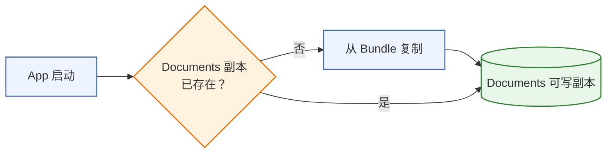
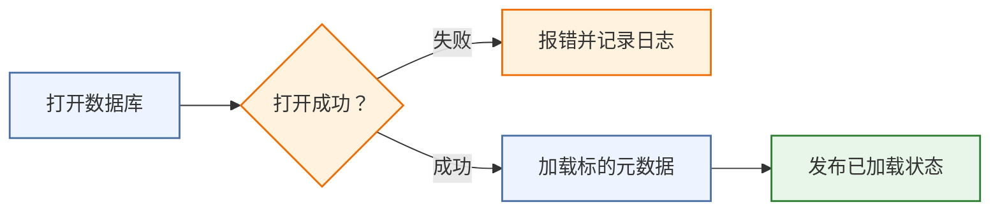
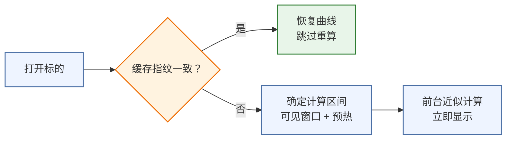
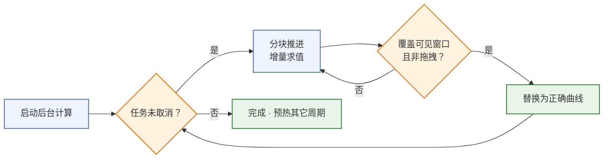
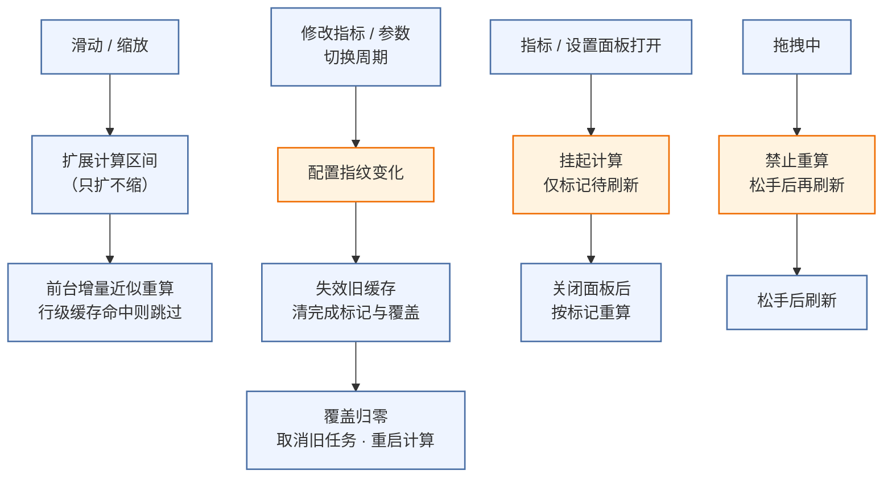
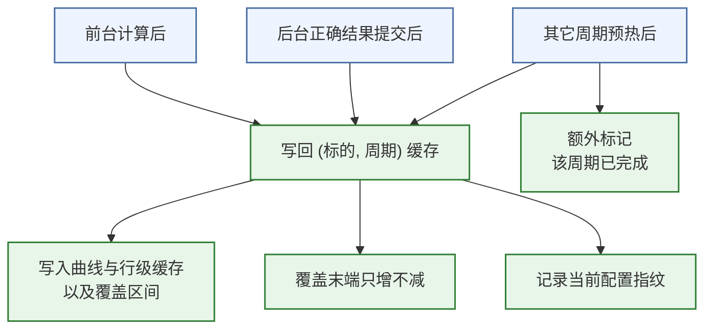
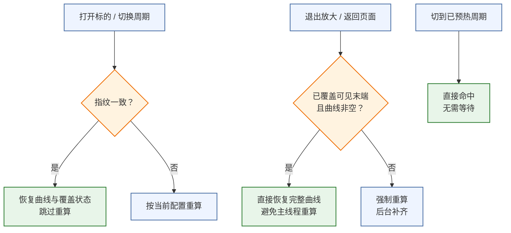
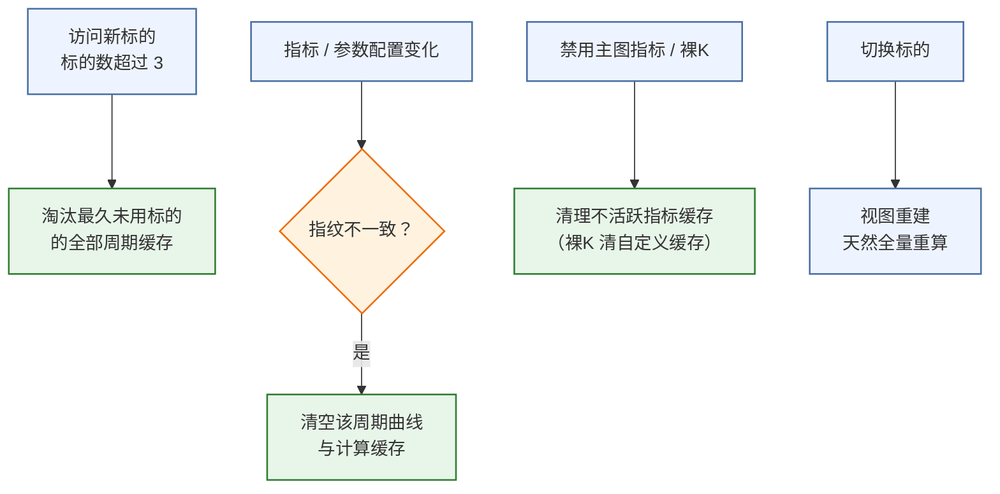

# Kline 数据库加载与指标计算机制

> 本文档以正文为主，Mermaid 图为辅。每个机制先讲清 "解决什么问题、关键步骤、边界"，再配一至两张只讲一件事的小图；图前有一句话说明从哪看起，图后补充图里没画的部分。

## 1. 数据库加载机制

### 1.1 解决的问题

行情数据存放在 SQLite 数据库 `tdx.db`（`meta` 表存标的元数据，`daily/weekly/monthly/quarterly/yearly` 表存各周期 K 线）。两个约束决定了加载方式：

* **Bundle 资源只读**：随 App 打包的种子库不能直接改，必须复制到 Documents 形成可写副本，也便于用户单独替换数据库更新行情。

* **SQLite 连接非线程安全**：单一连接 + 串行队列，所有 SQL 统一在 `dbQueue` 上执行，避免多线程并发访问同一连接导致崩溃。

### 1.2 加载流程

`DatabaseManager` 是全局单例，首次被页面引用时初始化，随后在 `dbQueue` 上异步执行加载：

1. `loadDatabase()` 先调 `ensureWritableDBExists()`：Documents 下已有 `tdx.db` 则直接用；没有则从 Bundle 种子库 `copyItem` 复制（首次启动）。

2. `openDatabase()` 用 `sqlite3_open` 打开 Documents 可写库；失败置 `errorMessage` 并写日志。

3. 成功后 `loadMetaList()` 查询 `meta` 表，主线程发布 `isLoaded = true` 与 `metaList`。

**图 1-1a 副本就绪**：从 "App 启动" 看起，先判断 Documents 是否已有可写副本，没有则从 Bundle 复制。

副本就绪后才打开数据库、加载元数据：

**图 1-1b 打开与加载**：从 "打开数据库" 看起，失败走报错分支，成功后依次加载元数据、发布已加载状态。

图里没画的部分：查询路径（见 1.3）、外部库只读切换（见 1.4）。

### 1.3 查询路径

页面触发查询，全部走 `dbQueue` 串行执行，返回 `[KlineItem]` 给图表引擎 / 行情表：

* `fetchBars(metaId, period)`：按周期查对应表（日 / 周 / 月 / 季 / 年），返回全量数据。

* `fetchPeriodLimited(metaId, table, limit)`：只取最近 N 根。行情 / 自选列表用 80 根，避免全量读（一次 1K+ 根）卡死主线程。

* `searchMeta(keyword)` / `searchMetaAsync`：`meta.name / meta.code` 模糊匹配（LIKE），异步版带主线程回调。

### 1.4 边界与预留

* **外部库只读切换**：`switchToExternalReadonly(path)` 设计用于 TrollStore 新容器只有种子库时，只读指向旧版完整 `tdx.db`（权限预检 → READONLY 打开 → WAL 锁失败用 `immutable=1` 兜底）。**当前无 UI 入口，全项目无调用点**，属预留接口。

## 2. 指标计算机制

### 2.1 首次计算（双层管线）

**解决的问题**：指标求值耗时随 K 线总数线性增长，全量同步计算会卡 UI；而 EMA/SMA 等递归指标必须从第一根开始累积才准确。因此采用两层管线：

* **前台近似**（主线程，立即显示）：只算 "可见窗口 + 预热 50 根"，用户马上看到曲线，前后段用 NaN 占位（渲染跳过 NaN）。

* **后台正确**（utility 优先级，分块推进）：从数据开头（索引 0）向右逐块计算，块大小几何增长（`step = max(500, 当前覆盖末端)`），配合**增量求值**（携带上一块状态，只算新增区间，总计算量约 O (N)）；正确覆盖推进到可见窗口末端后，才替换前台近似曲线。

**关键步骤**：

1. 打开标的 → `IndicatorComputationStore.init`：先一次性计算全量跳空缺口（`computeGaps`）；再尝试从缓存按 (标的，周期) 恢复（指纹一致才恢复，见 3.2）。

2. 前台：`recomputeMainCurves / recomputeSub` 用 `mergedCalcRange` 求计算区间（可见窗口 − 预热 50 → 可见末端，与已覆盖区间**只扩不缩**合并）；主图按输出行拆分、行级缓存复用；副图分 "自定义公式 / VOL・AMO 量均线 / 系统 .tdx 模板" 三路求值；最后 `padToFull` 补 NaN。

3. 后台：`startPrefetch` 生成 token 后循环 —— 主线程构造 `PrefetchCalcRequest`（共享序列 + 上一块增量状态）→ `Task.detached` 后台 `evaluateIncremental` → 主线程 `commitPrefetch`（`bgEnd ≥ 可见末端`且非拖拽才替换曲线）→ 更新覆盖末端并写回缓存。

4. 算到数据末尾 → `finishPrefetch` 标记该周期完成 → `prefetchOtherPeriod` 链式预热其它未计算周期（不切换可见周期）。

**边界**：拖动 / 缩放 / 切周期 / 改指标都会让 token 失效，后台循环检测到即停；指标 / 设置面板打开期间暂停后台计算。

**图 2-1a 缓存恢复与前台近似**：从 "打开标的" 看起，先按指纹判断能否恢复缓存；未命中则确定计算区间，做前台近似、立即显示。

前台显示的同时，后台开始正确计算并分块替换：

**图 2-1b 后台正确计算**：从 "启动后台计算" 看起，沿循环看覆盖替换；任务被取消则停止，并预热其它周期。

图里没画的部分：增量求值的内部状态（`TDXIncrementalState`）、行级缓存键规则（见 3.1）。

### 2.2 重算触发

**解决的问题**：不同用户操作对指标计算的影响不同，原则是 "能不重算就不重算、能后台算就后台算"。

四种触发场景：

* **滑动 / 缩放**：需要区间超出已覆盖 → `mergedCalcRange` 只扩不缩扩展区间 → 前台增量近似重算（行级缓存命中则整行跳过）→ 后台继续推进补齐。

* **修改指标 / 参数 / 切换周期（force）**：配置指纹变化 → `invalidateIfConfigChanged` 清掉旧缓存（完成标记 / 覆盖 / 曲线）→ `bgCoverageEnd = 0` → 取消旧后台任务 → 用新配置重启 `startPrefetch`。

* **指标 / 设置面板打开**：不计算（全量开销大），只标记 `pendingMainRefresh / pendingSubCharts`，关闭面板后再按标记重算。

* **拖拽中**：禁止任何指标重算（重算随总 K 数线性增长，是拖拽卡顿根源），置 `needsRefreshAfterDrag`，松手后刷新。

**图 2-2 重算触发**：四个入口在左侧，各自走向对应的处理动作，互不交叉。

图里没画的部分：`force` 与联动隔离组合时（搜索切标后的首次 onAppear）会走全量区间计算，属边界分支，正文 2.1 已覆盖主路径。

## 3. 缓存机制

### 3.1 缓存结构与写回

**结构**：`ChartCacheStore` 全局单例，按 `(metaId, 周期)` 存缓存条目；`MainIndicatorCache` 做主图输出行级缓存。Entry 关键字段：

| 字段                           | 类型                       | 说明                               |
| ---------------------------- | ------------------------ | -------------------------------- |
| mainCurves                   | \[IndicatorLine]         | 主图曲线                             |
| mainCache                    | MainIndicatorCache       | 输出行级缓存（units \[指标 id] → UnitSet） |
| subCurves                    | \[Int: \[IndicatorLine]] | 三副图曲线（槽位 0/1/2）                  |
| coverageStart / coverageEnd  | Int                      | 前台近似覆盖区间（绝对索引）                   |
| bgCoverageEnd                | Int                      | 后台正确计算覆盖末端                       |
| prefetchDone / isPrefetching | Bool                     | 完成标记 / 占用标记                      |
| configFingerprint            | String                   | 计算时所用指标配置指纹                      |

**写回时机**（三处）：前台计算后（`recomputeMainCurves / recomputeSub`）、后台正确结果提交后（`commitPrefetch`）、其它周期全量预热后（`prefetchOtherPeriod`，额外置 `prefetchDone = true`）。

**关键规则**：`bgCoverageEnd` **只增不减**（防止旧任务把已算更远的覆盖往回推）；每次写回同时更新 `configFingerprint` 为当前指纹，供下次加载校验。

**图 3-1 缓存写回**：从三个写入口看起，汇聚到 "写回 Entry"，右侧是实际写入的字段。

图里没画的部分：行级缓存键规则 —— 主图公式按 `formula|calcStart|calcEnd` 拆分输出行单元，单行按 `unit.text` 缓存，文本不变则整行复用，只重算变化的行。

### 3.2 缓存加载 / 恢复

**解决的问题**：同一标的内切周期、退出放大、重新进入时，不应重复计算已经算过的指标。

三个加载场景：

1. **打开标的 / 切换周期（init 恢复）**：`entry.configFingerprint == 当前指纹` 才恢复 `mainCurves / mainCache / subCurves / 覆盖区间 / bgCoverageEnd`，跳过重算；不一致说明配置变了，按新配置重算。

2. **退出主图放大 / 返回页面**：`recompute` 时若 `bgCoverageEnd ≥ 可见末端` 且指纹一致且缓存曲线非空，直接恢复完整曲线 —— 避免主线程全量重算卡顿。

3. **切到已预热周期**：`prefetchOtherPeriod` 已提前算好该周期，`init` 直接命中，无需等待。

**图 3-2 缓存加载**：三个场景各自判断后走向 "恢复" 或 "重算"。

图里没画的部分：恢复时还会校验曲线长度与当前数据一致，不一致（跨周期残留）按重算处理，避免 "声称已覆盖但曲线不对"。

### 3.3 缓存释放 / 失效

**解决的问题**：缓存不释放会无限占用内存；配置变化后旧缓存会污染新计算结果，必须按指纹失效。

四种释放时机：

1. **LRU 淘汰**：`metaOrder` 记录标的访问顺序，标的数超过 3 时淘汰最久未用标的所有周期缓存（`touch` 时触发）。

2. **配置失效**：`invalidateIfConfigChanged` 发现指纹不一致 → 清 `prefetchDone / bgCoverageEnd / mainCurves / mainCache / subCurves`，防止旧配置的 "已完成" 被误当新配置已完成。

3. **指标启用集合变化**：主图禁用某指标后，`mainCache.units` 清理不活跃 key；裸 K 模式清自定义指标 key（其余保留，切回裸 K 时复用）。

4. **切换标的**：视图重建、数据变化，缓存 key 不同，天然全量重算，互不影响。

**图 3-3 缓存释放 / 失效**：四个入口各自触发对应清理动作。

图里没画的部分：配置失效后调用方会把本视图 `bgCoverageEnd` 归零并重启预计算（防止写回把覆盖末端顶回旧值），该衔接在 2.2 的重算图中体现。